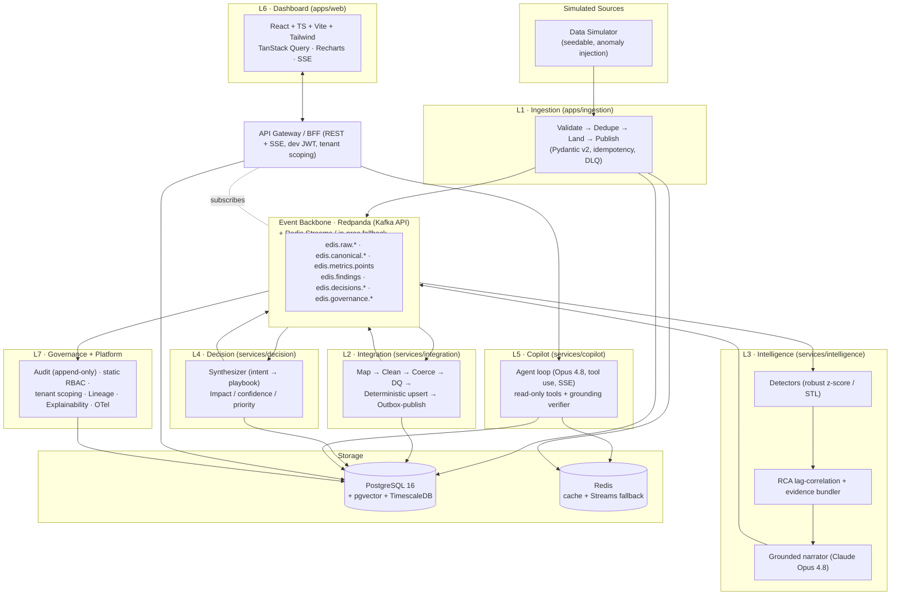
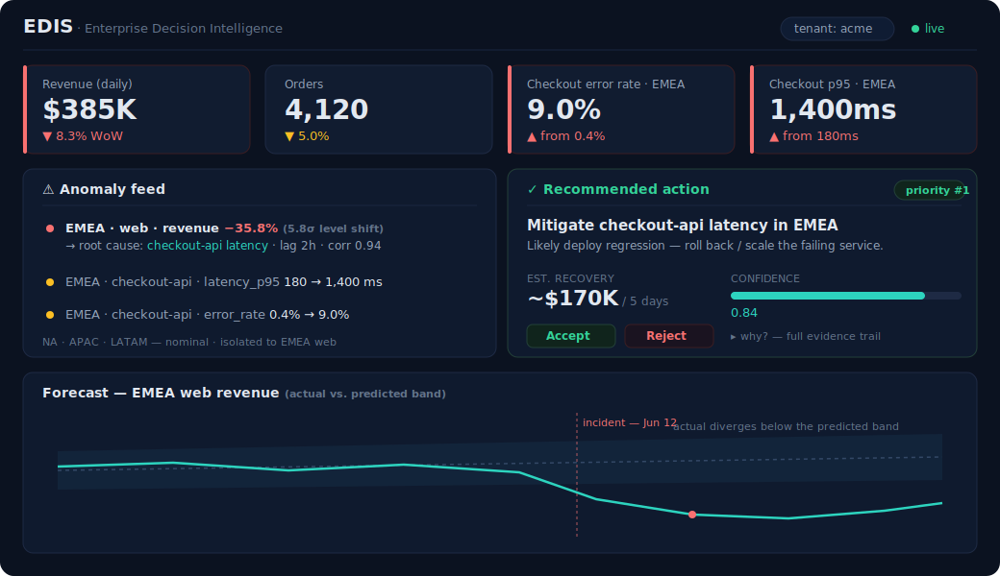
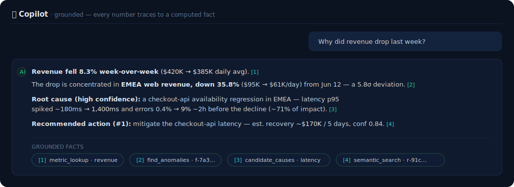

<div align="center">

# 🧭 EDIS — Enterprise Decision Intelligence System

### Real-time, explainable, **actionable** intelligence over a fragmented business.

EDIS unifies siloed enterprise data into one canonical model, detects anomalies and their
root cause with classical statistics, recommends a prioritized action, and answers
_"Why did revenue drop last week?"_ in natural language —
**with every number traced to a computed fact, never invented by an LLM.**

<br/>

[](https://github.com/jaswanthsurya007-source/enterprise-decision-intelligence/actions/workflows/ci.yml)
[](LICENSE)
[](#-testing--quality)
[](#-testing--quality)
[](#-tech-stack)
[](#-tech-stack)
[](#-the-grounded-ai-principle)

[**Architecture**](docs/ARCHITECTURE.md) · [**Getting Started**](#-getting-started) · [**How It Works**](#-how-it-works) · [**Business Value**](#-business-value--impact)

</div>

---

## 📌 Project Overview

**EDIS** is a seven-layer **decision-intelligence platform** that sits *across* an enterprise's
systems — CRM, ERP, operational logs, product analytics — and turns their fragmented data into
real-time, explainable, **actionable** decisions.

It ingests data over batch and streaming paths, unifies it into a single canonical model,
detects anomalies and performs root-cause analysis with reproducible statistics, recommends
prioritized actions with confidence scores, and exposes a **grounded AI copilot** that answers
natural-language questions over the live business — backed by an audit trail, lineage, and
observability throughout.

It is engineered as a **production-grade reference architecture**: clean separation of concerns,
a single source-of-truth contract library shared across Python and TypeScript, swappable
infrastructure behind ports, full test coverage, and one-command deployment. The entire vertical
slice runs **offline, with no Docker and no API keys**, and is proven end-to-end by an
in-process full-chain test.

---

## 🎯 Problem Statement

Enterprises run on **fragmented, siloed data**. Sales lives in the CRM, fulfillment in the ERP,
reliability signals in operational logs, behavior in product analytics. Each system has its own
schema, its own identifiers, its own notion of *"a customer."* The consequences are structural:

- **🧩 No single source of truth.** Nothing is unified, so every cross-cutting question requires
  manual stitching across tools.
- **🐢 Decisions are slow and retrospective.** By the time a human assembles a dashboard
  explaining last week's revenue dip, the window to act has closed.
- **🔍 No root cause, only symptoms.** Teams see *that* a metric moved, rarely *why* — or which
  upstream failure drove it.
- **🤖 AI you can't trust.** Generic LLM analytics hallucinate figures, making them unusable for
  decisions where correctness, auditability, and compliance are non-negotiable.

**There is no real-time, explainable, _actionable_ layer over the integrated business. EDIS is
that layer.**

---

## 🏗️ Solution & Architecture

EDIS is composed of **seven layers**, mediated by an event backbone and a shared canonical
store. An **API Gateway / BFF** is the single, tenant-scoped edge for the frontend (REST
snapshots + an SSE bridge + the copilot proxy).



| Layer | Module | Responsibility |
|---|---|---|
| **L1 · Ingestion** | `apps/ingestion` | The edge of trust: validate-at-edge, idempotency guard, envelope builder, raw-landing outbox, DLQ. Seedable simulator + chunked batch loader. |
| **L2 · Integration** | `services/integration` | System-of-record gatekeeper: map → clean → coerce → DQ → **deterministic id-keyed upsert** → metric derivation → transactional outbox. No LLM. |
| **L3 · Intelligence** | `services/intelligence` | Robust z-score / STL detection, lag-aware RCA + evidence bundler, an AutoETS forecast band, and a **grounded** Claude narrative. |
| **L4 · Decision** | `services/decision` | Finding → typed playbook → deterministic impact / confidence / priority → a ranked, explainable `Recommendation`. **All numbers from unit-tested code.** |
| **L5 · Copilot** | `services/copilot` | A streaming Claude tool-use loop over four read-only tools, with a grounding verifier — plus a fully **offline** deterministic agent that needs no key. |
| **L6 · Dashboard** | `apps/web` | React + TS cockpit (KPI grid, anomaly feed, recommendation card, forecast chart, copilot panel) over SSE; Zod validates every boundary. |
| **L7 · Governance** | `services/governance`, `libs/*` | Append-only audit, static RBAC, per-tenant scoping, lineage graph, explainability store, OpenTelemetry. |

> 📐 **Full design of record:** [**docs/ARCHITECTURE.md**](docs/ARCHITECTURE.md) — the canonical
> data model, every event topic, per-layer design, the demo walkthrough, and the phased roadmap.

### 🔒 The grounded-AI principle

EDIS treats AI as a **reasoning and explanation surface, never a source of truth**:

- **Statistics own the numbers.** Detection (STL, robust z-score), root cause (lag-aware
  correlation), forecasting (AutoETS), and all impact/confidence/priority scoring are
  deterministic, unit-tested code.
- **The LLM only narrates over computed evidence.** Claude is handed a fixed *evidence bundle*
  and a whitelist of allowed figures; a **grounding verifier** rejects any narrative containing a
  number that doesn't trace back to a real fact, falling back to a deterministic template.
- **Tenant isolation is enforced server-side.** Copilot tools are read-only and the tenant is
  injected from the verified token — the model can never query across tenants.

The result is AI that an enterprise can **trust, audit, and defend** — the prerequisite for
adoption in regulated, decision-critical environments.

---

## ✨ Key Features

- 🔄 **Cross-system ingestion** — batch + real-time, with edge validation, idempotency, dead-letter
  handling, and a transactional outbox (no lost or double-counted records).
- 🧩 **Unified canonical model** — heterogeneous sources mapped, cleaned, and deterministically
  reconciled into one trusted system of record on PostgreSQL + TimescaleDB.
- 🕵️ **Automated anomaly detection & root-cause analysis** — explainable, reproducible math that
  flags level shifts and correlates them to their upstream drivers.
- 💡 **Prioritized, explainable recommendations** — every action carries an impact estimate, a
  confidence score, a priority rank, and a full evidence trail.
- 💬 **Grounded AI copilot** — ask in plain English; get a streamed, **cited** answer that never
  fabricates a figure. Runs fully offline via a deterministic fallback agent.
- 📊 **Real-time dashboard** — live KPIs, an anomaly feed with drill-in, the recommendation card,
  forecast bands, and the copilot — all over SSE.
- 🛡️ **Governance by default** — append-only audit, RBAC, per-tenant scoping, data lineage, and
  explainability records for every AI decision.
- 🔭 **Built-in observability** — OpenTelemetry traces/metrics/logs → Prometheus + Grafana.
- 🧪 **Provably correct** — 523 Python tests, 35 frontend tests, and an in-process **full-chain
  e2e** that exercises every layer with no Docker and no keys.

---

## 🧰 Tech Stack

| Concern | Technology |
|---|---|
| **Backend** | Python 3.12 (async), FastAPI + Uvicorn, Pydantic v2 |
| **Data access** | SQLAlchemy 2.x async + asyncpg |
| **Event backbone** | Redpanda (Kafka API) via aiokafka — Redis Streams / in-proc fallback behind one port |
| **Storage** | PostgreSQL 16 + pgvector + TimescaleDB (canonical entities, embeddings, metric hypertables + continuous aggregates) |
| **Cache / dedupe** | Redis (idempotency `SETNX`, fact/narrative cache) |
| **Detection & forecasting** | statsmodels (STL), numpy (robust z-score), statsforecast (AutoETS) — classical, explainable, no training |
| **Reasoning / RCA narrative** | **Claude `claude-opus-4-8`** (adaptive thinking, tool use, streamed) |
| **Routing / classification** | **Claude `claude-haiku-4-5`** (structured outputs) |
| **Embeddings** | Voyage AI `voyage-3` → pgvector |
| **Frontend** | React 18 + TypeScript + Vite + Tailwind + TanStack Query v5 + Recharts + Zod |
| **Realtime** | Server-Sent Events (metrics, anomalies, recommendations, copilot tokens) |
| **Observability** | OpenTelemetry → Prometheus + Grafana; structured JSON logs |
| **AuthN/Z** | JWT + static table-driven RBAC; per-tenant scoping |
| **Packaging & CI** | Docker + Docker Compose, Makefile; pytest + testcontainers, vitest + MSW, ruff / mypy / black, GitHub Actions |

---

## ⚙️ How It Works

The canonical end-to-end scenario (tenant `acme`, seed `42`). The simulator seeds 90 days of
correlated history (~$420K/day revenue, weekly seasonality, four regions × three channels), then
injects the named `revenue_drop_emea` incident:

- An **ops outage** on `checkout-api` in EMEA: `latency_p95` spikes ~180ms → **~1,400ms** and
  `error_rate` ~0.4% → **~9%**.
- A consequent **revenue drop**: EMEA web revenue falls **~$95K → ~$61K/day (−35.8%)**, dragging
  total daily revenue ~$420K → ~$385K (**−8.3% WoW**).

The whole chain reacts automatically:

```
Ingest → Unify → Detect → Root-cause → Recommend → Explain → Visualize → Govern
```

| Layer | What happens |
|---|---|
| **L1 Ingestion** | Messy sales/ops records validated, coerced, enveloped, landed, published. |
| **L2 Integration** | Normalized to `CanonicalOrder` / `OpsEvent` + metric rows; daily rollups. |
| **L3 Intelligence** | STL flags a **`LEVEL_SHIFT`** on EMEA-web revenue (~$61K vs ~$95K, **5.8σ**); RCA ranks the `checkout-api` latency + error spikes as leading causes. |
| **L4 Decision** | One `operational_fix` recommendation — *"Mitigate checkout-api latency in EMEA"* — **impact ~$170K** over 5 days, **confidence 0.84**, **priority #1**. |
| **L5 Copilot** | Answers the question, citing the real figures. |
| **L6 Dashboard** | The EMEA KPI tile turns red; anomaly feed + rank-1 recommendation card surface live. |
| **L7 Governance** | Audit + lineage + explainability records for the entire turn. |

**The grounded copilot answer (streamed, cited):**

> **Revenue fell 8.3% week-over-week ($420K → $385K daily average).** `[1]`
>
> The drop is concentrated entirely in **EMEA web revenue**, which fell **35.8% ($95K → $61K/day)**
> beginning June 12. `[2]` This is a 5.8σ deviation from the seasonal expectation.
>
> **Root cause (high confidence):** an availability regression in `checkout-api` in EMEA. Latency
> p95 spiked from ~180ms to **~1,400ms** and the error rate rose from 0.4% to **~9%** about two
> hours before the revenue decline, accounting for ~71% of the attributed impact. `[3]`
>
> **Recommended action (priority #1):** Mitigate the `checkout-api` latency in EMEA — likely a
> deploy regression to roll back. Estimated recovery: **~$170K over the next 5 days**, confidence
> 0.84. `[4]`
>
> _Citations:_ `[1]` metric_lookup · `[2]` find_anomalies · `[3]` candidate causes · `[4]` semantic_search

> ✅ This exact chain — every layer's real entrypoint, **no Docker and no API keys** — is asserted
> by [`tests/e2e/test_full_chain.py`](tests/e2e/test_full_chain.py).

---

## 🖥️ UI Preview

The real-time operations cockpit — live KPIs, an anomaly feed with root-cause drill-in, the
prioritized recommendation with confidence + explainability, and the grounded copilot.

> _Representative previews of the running dashboard (the live UI is built in `apps/web` and driven
> by the gateway's REST + SSE). Run `make up` for the live app at `localhost:5173`._





---

## 💼 Business Value & Impact

EDIS targets the gap between **having data** and **making timely, trustworthy decisions**:

- ⚡ **From retrospective to real-time.** Anomalies are detected, explained, and acted on as they
  happen — compressing the loop from *days of manual analysis* to a live, automated chain.
- 🧩 **One trusted view across silos.** A single canonical model removes the cross-system stitching
  that slows every enterprise decision.
- 🛡️ **AI you can put in front of auditors.** Grounded, explainable, fully-logged AI is the
  prerequisite for adoption in regulated and decision-critical contexts — every figure is traceable
  to a computed fact with provenance.
- 📉 **Lower operational risk.** Root cause is surfaced automatically, shortening time-to-resolution
  and turning raw signals into prioritized, owner-ready actions.
- 🏢 **Enterprise-ready by design.** Multi-tenant scoping, RBAC, audit, lineage, observability, and
  horizontally-scalable stateless services are built in — not bolted on.

> In the built demo scenario, EDIS autonomously detects the EMEA revenue drop, attributes it to the
> checkout-api regression, and surfaces a prioritized action with an estimated **~$170K / 5-day
> recovery** and a complete evidence trail — illustrating the decision-acceleration the platform is
> designed to deliver. *(Figures are from the simulated `revenue_drop_emea` scenario.)*

---

## 🚀 Getting Started

**Prerequisites:** [Docker Desktop](https://www.docker.com/products/docker-desktop/) (Compose v2),
Python **3.12**, and Node **20+** (for the frontend). On Windows, run `make` from **Git Bash** or
**WSL** (one-liner equivalents are in the [`Makefile`](Makefile)).

```bash
# 0. Install the libs + services (editable, dependency-ordered)
make install

# 1. Bring up the full topology: postgres-timescale, redis, redpanda (+ console),
#    otel-collector, prometheus, grafana
make up

# 2. Run DB migrations (canonical tables, Timescale hypertables, audit, lineage…)
make migrate

# 3. Seed tenant `acme` + roles + calibration prior + ~90 days of correlated history
make seed

# 4. Run the demo: inject `revenue_drop_emea`, drive the full chain, print the story
make demo
```

Then open:

| Surface | URL |
|---|---|
| 📊 **Dashboard** (the live demo UI) | `http://localhost:5173`  *(`cd apps/web && npm install && npm run dev`)* |
| 📖 **API docs** (gateway OpenAPI) | `http://localhost:8000/docs` |
| 📈 **Grafana** (ingest/DLQ, consumer lag, LLM cost, grounding rate) | `http://localhost:3000` |
| 🔥 **Prometheus** | `http://localhost:9090` |
| 📬 **Redpanda Console** (topics / messages) | `http://localhost:8080` |

### 🔌 Offline / no-key by design

**EDIS runs end-to-end with no Docker and no API keys.** The entire vertical slice is exercised
in process — the simulator, the L1→L2→L3→L4 pipelines, and a **fully offline copilot** that routes
the question, calls the real read-only tools, and templates a grounded, cited answer from retrieved
facts. The real AI lights up when you provide keys:

| Env var | Lights up |
|---|---|
| `ANTHROPIC_API_KEY` | Streaming **Claude Opus 4.8 / Haiku 4.5** narrator (L3), intent classifier (L4), and the agentic copilot loop (L5). Without it, deterministic templates / rule-based classifiers keep the chain producing grounded output. |
| `VOYAGE_API_KEY` | **Voyage `voyage-3`** embeddings for the pgvector corpus (L3) and copilot semantic search (L5). Without it, a deterministic stub embedder keeps retrieval working. |

---

## 🧪 Testing & Quality

```bash
make test               # pure-Python suite — NO Docker, NO keys (integration tests skipped)
make test-integration   # Docker-backed suite (requires `make up`)
cd apps/web && npm test  # frontend (vitest)
```

- **523 Python unit tests** — contracts, platform SDK, every layer's pure logic, the grounding
  guards, the simulator's anomaly correctness, and the deterministic offline copilot.
- **Full-chain e2e** — [`tests/e2e/test_full_chain.py`](tests/e2e/test_full_chain.py) wires the
  *actual* entrypoint of every layer into one in-process run and asserts the whole
  `revenue_drop_emea` story end-to-end, with no Docker and no keys.
- **35 frontend tests** — components, SSE reconnect / out-of-order / snapshot refetch, and the
  **grounded-answer rendering guarantee** (the UI never renders an LLM free-text number as an
  authoritative metric).
- **Quality gates in CI** — ruff, black, mypy, the full Python suite, and a Python↔TypeScript
  contract **drift check** run on every push.

---

## 🔭 Future Enhancements

EDIS is a disciplined **vertical slice**: the architecture is designed end-to-end, but only the
demo-critical path is *built* — the guiding principle is **depth where it shows engineering
judgment over breadth that cannot be finished.** Everything below is **designed, contract-defined,
and interface-stubbed** — each seam (contract, topic, or no-op processor) already exists, so it can
be added **without changing any contract or topic.**

- 🔗 **Entity resolution + SCD-2 history** — fuzzy cross-system identity + slowly-changing dimensions.
- ♻️ **Feedback / calibration loop** — learn from action outcomes to recalibrate confidence.
- 🔐 **Tamper-evident audit** (hash chain + `/audit/verify`) and **Postgres RLS `FORCE`** isolation.
- 📈 **Full forecasting stack** — Prophet, per-metric model selection, breach projection.
- 🪪 **OIDC/PKCE auth** + Redis pub/sub RBAC-cache invalidation.
- 🔁 **Multiplexed WebSocket transport** with SSE→poll fallback.
- 🧠 **Expanded detectors & playbooks** — IQR / changepoint detectors, more action templates.
- ☸️ **Kubernetes manifests, Kafka Connect, OPA, Playwright e2e** for production hardening.

<details>
<summary><strong>Detailed "built vs. designed" breakdown (click to expand)</strong></summary>

| Deferred capability | Seam that already exists | Why deferred |
|---|---|---|
| Entity resolution + SCD-2 history | `SourceRef`/crosswalk shape, SCD-2 columns, `match_confidence` | Highest-effort, lowest-demo-value part of L2; the demo works on a deterministic id-keyed upsert. |
| Feedback / calibration loop | `OutcomeReport` contract + topic + no-op recorder + static prior | Not meaningfully testable against simulated outcomes; the static prior gives a believable confidence breakdown. |
| Hash-chained audit + `/audit/verify` | `AuditEvent` contract, append-only hypertable | Hard subsystem; deferred to avoid front-loading risk before data flows. |
| Postgres RLS `FORCE` + CI isolation test | `tenant_id` everywhere, tenant-scoped session, `db/rls.py` placeholder | RLS session-var plumbing is fiddly; app-level filtering is correct and cheap for the MVP. |
| Full forecasting stack | `Forecast` contract, `edis.forecasts.v1` topic, `forecast` copilot-tool seam | One AutoETS band is enough for the demo. |
| OIDC/PKCE + RBAC-cache invalidation | Dev JWT → `SecurityContext`, pure `evaluate()` | Dev JWT exercises the whole authz path; real IdP is hardening. |
| Multiplexed WebSocket + poll fallback | SSE bridge, `RealtimeProvider` | SSE covers the live demo; multiplexing is an optimization. |
| Full Decision FSM tail + extra playbooks | Minimal FSM, typed playbook stubs | One playbook + core lifecycle carries the demo. |
| IQR / `ruptures` detectors, insight rollup, customer-activity ingest | `Detector` protocol, topic convention, `CustomerActivity` contract | Robust-z + STL detect the demo anomaly; the rest is breadth. |
| Playwright e2e, K8s, Kafka Connect, OPA | CI skeleton, compose topology | Out of scope for the slice; vitest + the full-chain smoke cover correctness. |

</details>

---

## 📁 Repository Structure

```text
edis/
├── docker-compose.yml          # full topology: postgres-timescale, redis, redpanda, otel, prom, grafana
├── Makefile                    # install · up · down · migrate · seed · demo · test · lint
├── docs/
│   ├── ARCHITECTURE.md         # the design of record
│   └── img/                    # UI previews
├── libs/                       # shared platform SDK — imported by every service
│   ├── edis-contracts/         # SINGLE SOURCE OF TRUTH for all schemas (Pydantic v2)
│   ├── edis-platform/          # settings, logging, OTel, DB session, JWT/RBAC, bus ports
│   ├── edis-governance-sdk/    # emit_audit / emit_lineage / write_decision
│   └── edis-ts-contracts/      # Zod schemas mirrored from edis-contracts (CI drift-checked)
├── apps/
│   ├── ingestion/              # L1 — pipeline, simulator, batch loader, ingest + control API
│   └── web/                    # L6 — React dashboard
├── services/
│   ├── integration/            # L2 — normalization pipeline, deterministic upsert, outbox
│   ├── intelligence/           # L3 — detectors, RCA, forecast band, grounded narrator
│   ├── decision/               # L4 — synthesis, scoring, lifecycle, playbooks
│   ├── copilot/                # L5 — agent loop, read-only tools, grounding, offline agent
│   ├── governance/             # L7 — audit + lineage consumers, explainability, RBAC, seed
│   └── gateway/                # API Gateway / BFF — REST snapshots + SSE bridge + copilot proxy
├── scripts/
│   └── seed_demo.py            # one-command seed + demo orchestration
└── tests/
    └── e2e/                    # the full-chain in-process smoke + the live-stack version
```

---

## 📚 Learn More

- 📐 [**docs/ARCHITECTURE.md**](docs/ARCHITECTURE.md) — the authoritative architecture: canonical
  data model, event topics, per-layer design, cross-cutting concerns, demo walkthrough, and roadmap.
- 🛠️ [**Makefile**](Makefile) — every developer entrypoint, with Windows one-liner equivalents.
- ✅ [**tests/e2e/test_full_chain.py**](tests/e2e/test_full_chain.py) — proof that every layer's
  real entrypoint composes into the grounded demo, with no Docker and no keys.

---

## 📜 License

Released under the [MIT License](LICENSE).
