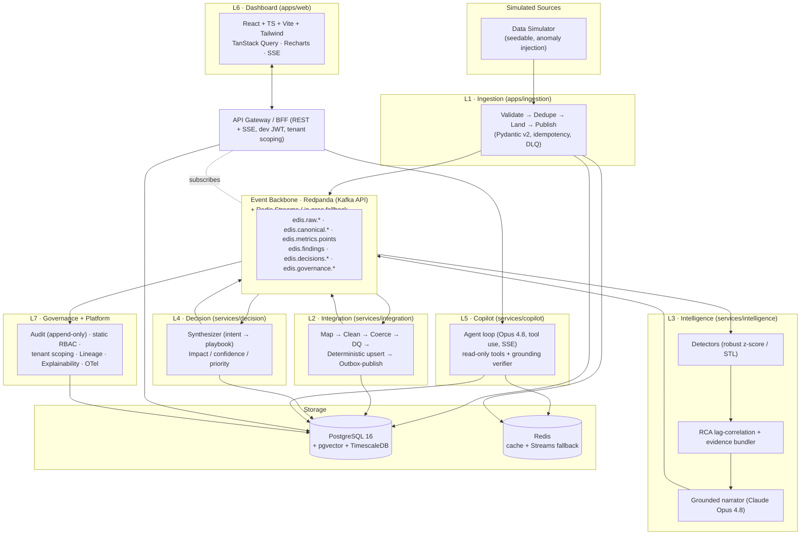

# EDIS — Enterprise Decision Intelligence System

> **Real-time, explainable, _actionable_ intelligence over a fragmented business.** EDIS
> ingests siloed sales / ops / customer data, unifies it into one canonical model, detects
> anomalies and their root cause with classical math, recommends a prioritized action, and
> answers _"Why did revenue drop last week?"_ in natural language — with **every number
> traced to a computed fact, never invented by an LLM.**

[](#testing)
[](#testing)
[](#testing)
[](#tech-stack)
[](#what-is-built-mvp-vs-designed-but-stubbed-future)


## The problem

Enterprises run on fragmented, siloed data. Sales lives in the CRM, fulfillment in the ERP,
reliability signals in operational logs, behavior in product analytics. Each system has its
own schema, its own identifiers, its own notion of "a customer." Because nothing is unified,
decision-making is slow and retrospective: by the time a human stitches together a dashboard
explaining last week's revenue dip, the window to act has closed. There is no real-time,
explainable, _actionable_ layer over the integrated business.

## What EDIS does

EDIS is a seven-layer platform for **cross-system decision intelligence**. With one
`make up` it:

1. **Ingests** simulated-but-realistic sales, operations, and customer-activity data over
   both batch and real-time streams, validating every record at the edge.
2. **Integrates** that heterogeneous input into one clean, deduplicated, time-aware
   **canonical model** in PostgreSQL + TimescaleDB — the system of record everything trusts.
3. **Detects & explains** — an intelligence engine finds anomalies (robust z-score / STL),
   performs lag-aware cross-dimensional root-cause analysis, and forecasts, all with
   classical, reproducible math, then attaches an LLM narrative **grounded strictly in the
   computed evidence**.
4. **Decides** — maps findings to prioritized, confidence-scored, explainable
   recommendations from a typed playbook.
5. **Answers** — a streaming, tool-using Claude copilot answers _"Why did revenue drop?"_ /
   _"What should we do?"_ by retrieving and computing over the canonical model, never by
   fabricating figures.
6. **Surfaces** a real-time dashboard with live KPIs, an anomaly feed, ranked
   recommendations, and the copilot — over SSE.
7. **Governs** — an append-only audit log, static RBAC, per-tenant scoping, data lineage,
   explainability storage, and OpenTelemetry observability.

> **The unbreakable AI rule:** the LLM **never invents numbers.** Every figure surfaced to a
> user originates from a computed or retrieved fact with provenance; narratives are
> post-validated against the evidence and discarded on mismatch.

---

## The demo — _"Why did revenue drop last week?"_

The canonical end-to-end scenario (tenant `acme`, seed `42`). The simulator seeds 90 days of
correlated history (~$420K/day revenue, weekly seasonality, four regions × three channels),
then injects the named `revenue_drop_emea` incident starting 7 days ago:

- An **ops outage** on `checkout-api` in EMEA: `latency_p95` spikes ~180ms → **~1,400ms** and
  `error_rate` ~0.4% → **~9%** for ~5 days.
- A consequent **revenue drop**: EMEA web revenue falls **~$95K/day → ~$61K/day (-35.8%)**,
  dragging total daily revenue ~$420K → ~$385K (-8.3% WoW).

The whole chain reacts:

| Layer | What happens |
|---|---|
| **L1 Ingestion** | Messy sales/ops records validated, coerced, wrapped in an `IngestEnvelope`, landed, published. |
| **L2 Integration** | Normalized to `CanonicalOrder` / `OpsEvent` + `MetricObservation` rows; daily rollups. |
| **L3 Intelligence** | STL flags a **LEVEL_SHIFT** on EMEA-web `revenue` (~$61K vs ~$95K, 5.8σ); RCA ranks the `checkout-api` `latency_p95` + `error_rate` spikes as the leading causes (~71% / ~22% contribution). |
| **L4 Decision** | One `operational_fix` recommendation — _"Mitigate checkout-api latency in EMEA"_ — **impact ~$170K** over 5 days, **confidence 0.84**, **priority rank #1**. |
| **L5 Copilot** | Answers the question, citing the real figures. |
| **L6 Dashboard** | The EMEA KPI tile turns red; the anomaly feed + rank-1 recommendation card surface live. |
| **L7 Governance** | Audit + lineage + explainability records for the whole turn. |

**The grounded copilot answer (streamed, cited):**

> **Revenue fell 8.3% week-over-week ($420K → $385K daily average).** [1]
>
> The drop is concentrated entirely in **EMEA web revenue**, which fell **35.8%
> ($95K → $61K/day)** beginning June 12. [2] This is a 5.8σ deviation from the seasonal
> expectation — not normal weekly variation.
>
> **Root cause (high confidence):** an availability regression in `checkout-api` in EMEA.
> Latency p95 spiked from ~180ms to **~1,400ms** and the error rate rose from 0.4% to
> **~9%** about two hours before the revenue decline, accounting for ~71% of the attributed
> impact. [3] Other regions and channels were unaffected.
>
> **Recommended action (priority #1):** Mitigate the `checkout-api` latency in EMEA — likely
> a deploy regression to roll back. Estimated recovery: **~$170K over the next 5 days** if
> resolved now, confidence 0.84. [4]
>
> _Citations:_ [1] metric `revenue` weekly — `metric_lookup`. [2] Finding — `find_anomalies`.
> [3] candidate causes (latency_p95, error_rate). [4] Recommendation — `semantic_search`.

This exact chain — every layer's real entrypoint, no Docker and no API keys — is asserted by
the [`tests/e2e/test_full_chain.py`](tests/e2e/test_full_chain.py) full-chain test.

---

## Architecture

Seven layers, mediated by an event backbone and a shared canonical store. The
**API Gateway / BFF** is the single edge for the frontend (REST snapshots + SSE bridge +
copilot proxy, with dev-JWT tenant scoping). Solid boxes are **[MVP]** (built); dashed
`future` boxes are **[Designed — stub]** (the seam exists, the implementation is deferred).



| Layer | Module | Responsibility |
|---|---|---|
| **L1 · Ingestion** | `apps/ingestion` | The edge of trust: validate@edge, idempotency guard, envelope builder, raw-landing outbox, DLQ. Seedable simulator + chunked batch loader. |
| **L2 · Integration** | `services/integration` | System-of-record gatekeeper: map → clean → coerce → DQ → **deterministic id-keyed upsert** → metric derivation → transactional outbox. No LLM. |
| **L3 · Intelligence** | `services/intelligence` | Robust z-score / STL detection, lag-aware RCA + evidence bundler, one AutoETS forecast band, and a **grounded** Claude narrative. |
| **L4 · Decision** | `services/decision` | Finding → typed playbook → deterministic impact / confidence / priority → a ranked, explainable `Recommendation`. All numbers from unit-tested code. |
| **L5 · Copilot** | `services/copilot` | A manual streaming Claude tool-use loop over 4 read-only tools, with a grounding verifier; a fully **offline** deterministic agent with no key. |
| **L6 · Dashboard** | `apps/web` | React + TS overview (KPI grid, anomaly feed, recommendation card, forecast chart, copilot panel) over SSE; Zod validates every boundary. |
| **L7 · Governance** | `services/governance`, `libs/*` | Append-only audit, static RBAC, per-tenant scoping, lineage graph, explainability store, OpenTelemetry. |

Full design of record: **[docs/ARCHITECTURE.md](docs/ARCHITECTURE.md)** — the canonical data
model, every event topic, per-layer design, the demo walkthrough, and the roadmap.

---

## Quickstart (one command)

**Prerequisites:** [Docker Desktop](https://www.docker.com/products/docker-desktop/) (Compose
v2), Python **3.12**, and (for the frontend) Node 20+. On Windows, run `make` from **Git Bash**
or **WSL** (the one-liner equivalents are noted in the [`Makefile`](Makefile)).

```bash
# 0. install the libs + services (editable, dependency-ordered)
make install

# 1. bring up the full topology: postgres-timescale, redis, redpanda (+ console),
#    otel-collector, prometheus, grafana   (use `make up-apps` to also build the services)
make up

# 2. run DB migrations (canonical tables, Timescale hypertables, audit, lineage…)
make migrate

# 3. seed tenant `acme` + roles + the calibration prior + ~90 days of correlated history
make seed

# 4. run the demo: inject `revenue_drop_emea`, drive the full chain, print the story
make demo
```

Then open:

| What | URL |
|---|---|
| **Dashboard** (the live demo UI) | http://localhost:5173 (`cd apps/web && npm install && npm run dev`) |
| **API docs** (gateway OpenAPI) | http://localhost:8000/docs |
| **Grafana** (ingest/DLQ, consumer lag, LLM cost, grounding rate) | http://localhost:3000 |
| **Prometheus** | http://localhost:9090 |
| **Redpanda Console** (topics / messages) | http://localhost:8080 |

### Offline / no-key by design

**EDIS runs end-to-end with no Docker and no API keys.** The whole vertical slice is exercised
in process: the simulator, the L1→L2→L3→L4 pure pipelines, and a **fully offline copilot** that
routes the question, calls the real read-only tools, and templates a grounded, cited answer from
the retrieved facts — never inventing a number. Run it with `make test` (see [Testing](#testing)).

The real AI lights up when you provide keys:

| Env var | Lights up |
|---|---|
| `ANTHROPIC_API_KEY` | The streaming **Claude Opus 4.8 / Haiku 4.5** narrator (L3), intent classifier (L4), and the agentic copilot tool-use loop (L5). Without it, deterministic templates / rule-based classifiers take over and the chain still produces grounded output. |
| `VOYAGE_API_KEY` | **Voyage `voyage-3`** embeddings for the pgvector corpus (L3) and the copilot's semantic search (L5). Without it, a deterministic stub embedder keeps retrieval working in tests/offline. |

---

## Testing

```bash
make test              # pure-python suite — NO Docker, NO keys (integration tests skipped)
make test-integration  # the Docker-backed suite (requires `make up` first)
cd apps/web && npm test # frontend vitest
```

- **523 Python unit tests** — contracts, platform SDK, every layer's pure logic, the
  grounding guards, the simulator's anomaly correctness, and the deterministic offline copilot.
- **The full-chain e2e** — [`tests/e2e/test_full_chain.py`](tests/e2e/test_full_chain.py)
  wires the **actual pure entrypoint of every layer** into one in-process run (no Docker, no
  keys) and asserts the whole `revenue_drop_emea` story: a `LEVEL_SHIFT` finding on EMEA-web
  revenue (~-36%) with `checkout-api` latency/error ranked as leading causes, an
  `operational_fix` recommendation (~$170K, confidence ~0.84, rank #1), and a grounded copilot
  answer citing the real figures (**61000 / 95000 / -35.8 / 170000**) with no invented numbers.
  The live-stack version ([`test_full_chain_docker.py`](tests/e2e/test_full_chain_docker.py))
  runs the same chain over Redpanda + Postgres behind `@pytest.mark.integration`.
- **35 frontend vitest** — component tests, SSE reconnect / out-of-order / snapshot refetch,
  and the grounded-answer rendering guarantee (the UI never renders an LLM free-text number as
  an authoritative metric).

Anything needing Postgres / Redpanda / Redis is marked `@pytest.mark.integration` and excluded
from the default selection, so the suite passes on a laptop with neither Docker nor keys.

---

## Tech stack

| Concern | Technology |
|---|---|
| Backend | Python 3.12 (async), FastAPI + Uvicorn, Pydantic v2 |
| DB access | SQLAlchemy 2.x async + asyncpg |
| Event backbone | Redpanda (Kafka API) via aiokafka — Redis Streams / in-proc fallback behind one port |
| Storage | PostgreSQL 16 + pgvector + TimescaleDB (canonical entities, embeddings, metric hypertables + continuous aggregates) |
| Cache / dedupe | Redis (idempotency `SETNX`, fact/narrative cache) |
| Detection | statsmodels (STL), numpy (robust z-score) — classical, explainable, no training |
| Forecasting | statsforecast (AutoETS) — one model for the band |
| Reasoning / RCA narrative | **Claude `claude-opus-4-8`** (adaptive thinking, tool use, streamed) |
| Routing / classification | **Claude `claude-haiku-4-5`** (structured outputs) |
| Embeddings | Voyage AI `voyage-3` → pgvector |
| Frontend | React 18 + TypeScript + Vite + Tailwind + TanStack Query v5 + Recharts + Zod |
| Realtime | SSE (metrics, anomalies, recommendations, copilot tokens) |
| Observability | OpenTelemetry → Prometheus + Grafana; structured JSON logs |
| AuthN/Z | Dev JWT + static table-driven RBAC (MVP) |
| Packaging | Docker + docker-compose, Makefile, `.env.example` |
| Quality | pytest + httpx + testcontainers, vitest + MSW, ruff / mypy / black, GitHub Actions CI |

---

## UI preview

The real-time operations cockpit — live KPIs, an anomaly feed with root-cause drill-in, the
prioritized recommendation with confidence + explainability, and the grounded copilot. Run the
stack (`make up`) for the live React app at `localhost:5173`.

> _Representative previews of the running dashboard (the live UI is built in `apps/web` —
> React + Vite + Tailwind + Recharts, driven by the gateway's REST + SSE)._


---

## What is built (MVP) vs. designed-but-stubbed (future)

This is a portfolio system built by one engineer in ~2 weeks. The architecture is designed
end-to-end and enterprise-grade, but only a disciplined **vertical slice** is _built_ in the
MVP — the principle is **depth where it shows engineering judgment over breadth that cannot be
finished.** The committed slice is:

> **sales + ops ingest → canonical model + metric hypertable → STL / robust-z-score detection
> + lag-correlation RCA → one typed playbook recommendation → grounded copilot answer → live
> dashboard tile.**

Everything else is **designed, contract-defined, and interface-stubbed** — its seam (contract,
topic, or no-op processor) already exists, so it can be added later **without changing any
contract or topic**. Honestly listed (wording from [ARCHITECTURE §10](docs/ARCHITECTURE.md)):

| Deferred capability | Seam that already exists | Why deferred |
|---|---|---|
| **Entity resolution + SCD-2 history** | `SourceRef`/crosswalk shape, SCD-2 columns, `match_confidence` | Highest-effort, lowest-demo-value part of L2; the demo works on a deterministic id-keyed upsert. |
| **Feedback / calibration loop** | `OutcomeReport` contract + `edis.feedback.outcomes.v1` topic + no-op recorder + static calibration prior | Untestable/undemonstrable against simulated outcomes in 2 weeks; the static prior gives a believable confidence breakdown. |
| **Hash-chained audit + `/audit/verify`** | `AuditEvent` contract, append-only hypertable | Hard subsystem that would front-load risk before any data flows. |
| **Postgres RLS `FORCE` + CI cross-tenant isolation test** | `tenant_id` everywhere, tenant-scoped session, `db/rls.py` placeholder | RLS session-var plumbing through async SQLAlchemy + outbox + consumers is fiddly; app-level filtering is correct and cheap. |
| **Full forecasting stack** (Prophet, per-metric selector, breach projector, `FORECAST_BREACH`) | `Forecast` contract, `edis.forecasts.v1` topic, `forecast` copilot-tool seam | One AutoETS band is enough for the demo; breadth doesn't add demo value. |
| **OIDC/PKCE + Redis pub/sub RBAC invalidation** | Dev JWT → `SecurityContext`, pure `evaluate()` | Dev static JWT exercises the whole authz path end-to-end; real IdP integration is hardening. |
| **Multiplexed WebSocket bridge + SSE→poll fallback** | SSE bridge, `RealtimeProvider` | SSE alone covers the live demo; multiplexing is an optimization. |
| **Full Decision FSM tail** (`in_progress`/`outcome_recorded`) + extra playbooks | Minimal FSM, typed playbook stubs | One playbook + `proposed/accepted/rejected/expired` carries the demo. |
| **IQR / `ruptures` detectors, `edis.insights.v1` rollup, customer-activity ingest** | `Detector` protocol, topic naming convention, `CustomerActivity` contract + connector stub | Robust-z + STL detect the demo anomaly; rollups/extra domains are breadth. |
| **Playwright e2e, K8s manifests, Kafka Connect, OPA** | CI skeleton, compose topology | Out of scope for a 2-week one-engineer build; vitest + MSW + the backend full-chain smoke cover correctness. |

---

## Repository structure

```text
edis/
├── docker-compose.yml          # full topology: postgres-timescale, redis, redpanda, otel, prom, grafana
├── Makefile                    # install · up · down · migrate · seed · demo · test · lint
├── README.md                   # (this file)
├── docs/
│   ├── ARCHITECTURE.md         # the design of record
│   └── img/                    # screenshots
├── libs/                       # shared platform SDK — imported by every service
│   ├── edis-contracts/         # SINGLE SOURCE OF TRUTH for all schemas (Pydantic v2)
│   ├── edis-platform/          # settings, logging, OTel, DB session, JWT/RBAC, bus ports
│   ├── edis-governance-sdk/    # emit_audit / emit_lineage / write_decision
│   └── edis-ts-contracts/      # Zod schemas generated from edis-contracts (CI drift-checked)
├── apps/
│   ├── ingestion/              # L1 — pipeline, simulator, batch loader, ingest + control API
│   └── web/                    # L6 — React dashboard
├── services/
│   ├── integration/            # L2 — normalization pipeline, deterministic upsert, outbox
│   ├── intelligence/           # L3 — detectors, RCA, forecast band, grounded narrator
│   ├── decision/               # L4 — synthesis, scoring, lifecycle, playbooks
│   ├── copilot/                # L5 — agent loop, read-only tools, grounding, offline agent
│   ├── governance/             # L7 — audit + lineage consumers, explainability, RBAC, seed
│   └── gateway/                # API Gateway / BFF — REST snapshots + SSE bridge + copilot proxy
├── scripts/
│   └── seed_demo.py            # one-command seed + demo orchestration (Z1)
└── tests/
    └── e2e/                    # the full-chain in-process smoke + the live-stack version
```

---

## Learn more

- **[docs/ARCHITECTURE.md](docs/ARCHITECTURE.md)** — the authoritative architecture: canonical
  data model, event topics, per-layer design, cross-cutting concerns, the demo walkthrough, and
  the phased roadmap.
- **[Makefile](Makefile)** — every developer entrypoint, with Windows one-liner equivalents.
- **[tests/e2e/test_full_chain.py](tests/e2e/test_full_chain.py)** — the crown-jewel proof that
  every layer's real entrypoint composes into the grounded demo, with no Docker and no keys.
