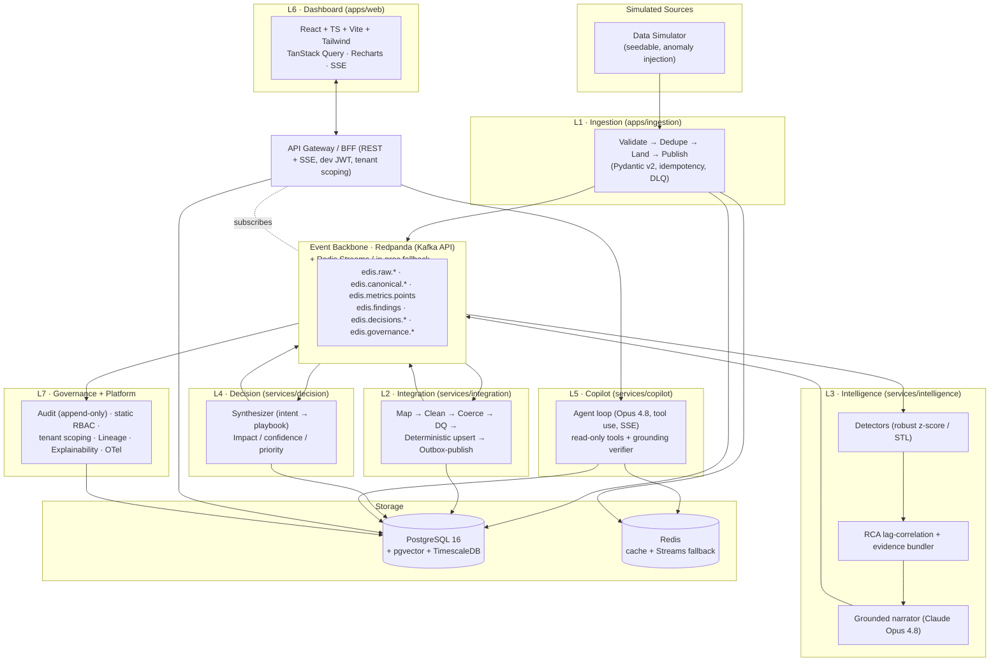

# EDIS — Enterprise Decision Intelligence System

[](https://github.com/jaswanthsurya007-source/enterprise-decision-intelligence/actions/workflows/ci.yml)
[](LICENSE)
[](#tech-choices)
[](#tests)

EDIS is a working reference implementation of a **decision-intelligence platform** — the kind of
system that sits across a company's CRM, ERP, and operational logs and tries to answer *"what just
changed, what caused it, and what should we do about it"* closer to real time than the weekly
report does. It ingests data, unifies it into one model, finds anomalies and their root cause,
proposes a ranked action, and lets you ask questions about all of it in plain English.

The one rule I held to everywhere: **the AI never makes up a number.** The statistics do the math;
the language model only explains what the math already found, and a verifier throws the explanation
out if it cites a figure that isn't backed by a computed fact. More on that below — it's the part I
care most about.

A note on scope before anything else: this is a **vertical slice**, not a finished product. I built
one path all the way through every layer rather than building every box halfway. What's real and
what's deliberately stubbed is spelled out plainly in [What's built, what isn't](#whats-built-what-isnt) —
I'd rather you know than find out.


---

## What it does

The whole thing is easiest to understand through the scenario I built it around. A simulator seeds
~90 days of correlated sales and ops data (tenant `acme`, fixed seed, four regions × three
channels, ~$420K/day in revenue with weekly seasonality), then injects an incident called
`revenue_drop_emea`:

- `checkout-api` in EMEA starts struggling — p95 latency climbs from ~180ms to ~1,400ms and the
  error rate goes from ~0.4% to ~9%.
- A few hours later EMEA web revenue follows it down, from ~$95K/day to ~$61K/day. That's enough to
  drag the company-wide number from ~$420K to ~$385K — down 8.3% week over week.

From there the system does what an analyst would do, without being asked:

| Layer | What happens |
|---|---|
| Ingestion (L1) | Messy source records get validated, coerced, wrapped, landed, and published. |
| Integration (L2) | They become clean `CanonicalOrder` / `OpsEvent` rows and derived metrics, with daily rollups. |
| Intelligence (L3) | STL flags a level shift on EMEA-web revenue (~$61K against an expected ~$95K — about 5.8σ). Lag-aware correlation pins the cause on the `checkout-api` latency and error spikes that lead it. |
| Decision (L4) | That finding becomes one recommendation — *mitigate the checkout-api latency in EMEA* — with an estimated ~$170K recovery over five days, a confidence of 0.84, and priority rank #1. |
| Copilot (L5) | Ask *"why did revenue drop last week?"* and it answers in prose, citing the figures. |
| Dashboard (L6) | The EMEA tile goes red; the anomaly and the recommendation show up live. |
| Governance (L7) | Every step leaves an audit entry, a lineage edge, and an explainability record. |

Here's the copilot's actual answer shape, citations and all:

> **Revenue fell 8.3% week-over-week ($420K → $385K daily average).** [1]
>
> The drop is concentrated entirely in **EMEA web revenue**, which fell **35.8% ($95K → $61K/day)**
> beginning June 12. [2] That's a 5.8σ deviation from the seasonal expectation, not normal weekly
> noise.
>
> **Root cause (high confidence):** an availability regression in `checkout-api` in EMEA. Latency
> p95 spiked from ~180ms to **~1,400ms** and the error rate rose from 0.4% to **~9%** roughly two
> hours before revenue moved, accounting for about 71% of the impact. [3]
>
> **Suggested action (priority #1):** roll back / mitigate the `checkout-api` latency in EMEA.
> Estimated recovery ~**$170K over five days** if handled now, confidence 0.84. [4]
>
> *[1] metric_lookup · [2] find_anomalies · [3] candidate causes · [4] semantic_search*


Every number there comes from a tool result, not from the model's imagination. The whole chain —
each layer's real code, no Docker and no API keys — is what [`tests/e2e/test_full_chain.py`](tests/e2e/test_full_chain.py)
asserts, so it's not a screenshot I'm hoping still works.

---

## The problem it addresses

Most companies don't have a data problem so much as a *seams* problem. Sales is in the CRM,
fulfillment in the ERP, reliability in the logs, behavior in product analytics — each with its own
schema, its own IDs, its own idea of what "a customer" is. Nothing is joined up, so every question
that crosses two systems turns into a manual exercise, and by the time someone has stitched together
a chart explaining last week's dip, last week is over.

The harder problem underneath it: even when teams reach for an LLM to close that gap, they get
answers they can't trust. A model that confidently invents a revenue figure is worse than useless
for a decision someone has to defend to finance or an auditor. So the interesting question isn't
"can an LLM summarize my dashboard" — it's "can I build an AI layer whose every claim is traceable
to a real, computed fact." That constraint shaped the whole design.

---

## How it's built

Seven layers, talking over an event bus, sharing one canonical store. A gateway (a BFF) is the only
thing the browser talks to — it serves REST snapshots, bridges bus topics to the UI over SSE, and
proxies the copilot, all scoped to a tenant from the verified token.



| Layer | Module | What it's responsible for |
|---|---|---|
| L1 · Ingestion | `apps/ingestion` | The edge of trust. Validates at the boundary, guards idempotency, builds the envelope, lands raw events through an outbox, dead-letters the rest. Ships with the simulator and a chunked batch loader. |
| L2 · Integration | `services/integration` | The gatekeeper for the system of record: map, clean, coerce, run data-quality checks, deterministically upsert, derive metrics, publish through a transactional outbox. No LLM anywhere near it. |
| L3 · Intelligence | `services/intelligence` | Robust z-score and STL detection, lag-aware root-cause correlation, an AutoETS forecast band, and a Claude narrative that's grounded in the computed evidence. |
| L4 · Decision | `services/decision` | Turns a finding into a typed playbook action and scores its impact, confidence, and priority. Every number comes from unit-tested code, not the model. |
| L5 · Copilot | `services/copilot` | A streaming Claude tool-use loop over four read-only tools with a grounding check — and a deterministic agent that does the same job with no API key at all. |
| L6 · Dashboard | `apps/web` | The React cockpit (KPIs, anomaly feed, recommendation card, forecast, copilot) over SSE, with Zod validating every payload at the boundary. |
| L7 · Governance | `services/governance`, `libs/*` | Append-only audit, static RBAC, per-tenant scoping, a lineage graph, an explainability store, and OpenTelemetry wiring. |

The full design — canonical model, every event topic, per-layer detail, the roadmap — lives in
[`docs/ARCHITECTURE.md`](docs/ARCHITECTURE.md).

### Why the AI is trustworthy here

This is the part I'd want a reviewer to look at first, because it's where most "AI analytics" demos
fall down.

- The math is the source of truth. Detection, root cause, forecasting, and all the
  impact/confidence/priority scoring are ordinary deterministic code with tests. None of it depends
  on the model being available, or correct.
- The model is handed a fixed bundle of computed facts plus a whitelist of the figures it's allowed
  to use. After it writes its answer, a verifier pulls every number out of the text and checks each
  one against that whitelist. Anything that doesn't match means the answer is discarded and a plain
  templated explanation is used instead.
- The copilot's tools are read-only, and the tenant is injected on the server from the token — the
  model can't widen its own access or reach another tenant's data, even if a prompt tries to make it.

The practical upshot: the system degrades to deterministic, grounded output when the model is wrong,
unavailable, or absent entirely. That's a property you can actually take to a compliance
conversation.

---

## Running it

You'll need [Docker Desktop](https://www.docker.com/products/docker-desktop/) (Compose v2), Python
3.12, and Node 20+ for the frontend. On Windows, run `make` from Git Bash or WSL (the
[`Makefile`](Makefile) lists the one-liner equivalents).

```bash
make install   # install the libs + services, editable, in dependency order
make up        # postgres+timescale, redis, redpanda (+ console), otel, prometheus, grafana
make migrate   # canonical tables, Timescale hypertables, audit, lineage
make seed      # tenant acme, roles, the calibration prior, ~90 days of history
make demo      # inject revenue_drop_emea, run the chain, print the story
```

Then:

| | |
|---|---|
| Dashboard | `http://localhost:5173` (`cd apps/web && npm install && npm run dev`) |
| Gateway API docs | `http://localhost:8000/docs` |
| Grafana | `http://localhost:3000` |
| Prometheus | `http://localhost:9090` |
| Redpanda console | `http://localhost:8080` |

**You don't actually need any of that to see it work.** The whole vertical slice runs in process
with no Docker and no keys — `make test` exercises it, including a copilot that routes the question,
calls the real tools, and returns a grounded, cited answer using a deterministic fallback. Real
Claude and Voyage only come into play when you set the keys:

| Set this | And you get |
|---|---|
| `ANTHROPIC_API_KEY` | The streaming Claude Opus 4.8 / Haiku 4.5 narrator, intent classifier, and the agentic copilot loop. Without it, templates and rule-based routing keep the chain producing grounded output. |
| `VOYAGE_API_KEY` | Voyage `voyage-3` embeddings for retrieval. Without it, a deterministic stub embedder keeps search working in tests. |

---

## Tests

```bash
make test               # the python suite — no Docker, no keys
make test-integration   # the Docker-backed suite (run make up first)
cd apps/web && npm test  # the frontend
```

What's covered: 523 Python unit tests (the contracts, the platform SDK, each layer's logic, the
grounding checks, the simulator's anomaly correctness, the offline copilot); 35 frontend tests
(components, SSE reconnect / out-of-order / refetch, and a test that the UI never renders a number
from the model's prose as if it were an authoritative metric); and the full-chain end-to-end test
that runs every layer's real entrypoint in one process and checks the whole `revenue_drop_emea`
story holds. Anything that needs Postgres, Redpanda, or Redis is marked `integration` and skipped by
default, so the suite is green on a laptop with neither Docker nor keys. CI runs ruff, black, mypy,
the Python suite, and a Python↔TypeScript contract drift check on every push.

---

## What's built, what isn't

The thing I most want to be straight about. The committed slice is the path the demo needs:

> sales + ops ingest → canonical model + metric hypertable → STL / robust-z detection +
> lag-correlation RCA → one typed-playbook recommendation → grounded copilot answer → live
> dashboard tile.

Everything below is designed and has its seam in place — the contract, the topic, or the no-op
processor already exists — but isn't built out, on purpose. The point was depth on one path over a
field of half-finished features, and each of these can be added later without changing a contract or
a topic.

- Fuzzy entity resolution and full SCD-2 history (the demo uses a deterministic id-keyed upsert).
- The feedback / calibration loop that would learn from outcomes (the contract, topic, and a no-op
  recorder exist; confidence currently uses a static prior).
- Tamper-evident audit (a hash chain over the append-only log) and Postgres row-level security.
- The wider forecasting stack — Prophet, per-metric model selection, breach projection.
- OIDC/PKCE auth in place of the dev JWT, and RBAC-cache invalidation.
- A multiplexed WebSocket transport with a polling fallback (today it's SSE, which is plenty for
  the demo).
- More detectors and playbooks, Kubernetes manifests, Kafka Connect, OPA, Playwright.

If you want the long version with the exact seam for each, it's in `docs/ARCHITECTURE.md` §10.

---

## Tech choices

| Area | Choice | Why |
|---|---|---|
| Backend | Python 3.12 (async), FastAPI, Pydantic v2 | Fast to write, and Pydantic doubles as the contract layer. |
| Data | SQLAlchemy 2.x async + asyncpg; PostgreSQL 16 + TimescaleDB + pgvector | One database for relational data, time series, and vector search keeps the moving parts down. |
| Event bus | Redpanda (Kafka API), with Redis Streams / in-process behind one port | Real partitioning and replay for the demo; the in-proc fallback is what makes the whole thing runnable on a laptop. |
| Detection / forecasting | statsmodels (STL), numpy (robust z-score), statsforecast (AutoETS) | Classical, explainable, and no training step — which matters when you have to justify the output. |
| Reasoning | Claude `claude-opus-4-8` (narrative, tool use) and `claude-haiku-4-5` (routing/classification) | Opus for the agentic loop, Haiku for the cheap structured calls. |
| Embeddings | Voyage `voyage-3` → pgvector | |
| Frontend | React 18, TypeScript, Vite, Tailwind, TanStack Query, Recharts, Zod | Zod is generated from the same contracts as the backend, so the two can't silently drift. |
| Ops | OpenTelemetry → Prometheus + Grafana; Docker Compose; GitHub Actions | |

---

## Project layout

```text
edis/
├── docker-compose.yml          # the full local topology
├── Makefile                    # install · up · down · migrate · seed · demo · test · lint
├── docs/
│   ├── ARCHITECTURE.md         # the real design doc
│   └── img/                    # UI previews
├── libs/                       # the shared SDK every service imports
│   ├── edis-contracts/         # the single source of truth for schemas (Pydantic v2)
│   ├── edis-platform/          # settings, logging, OTel, DB, JWT/RBAC, bus ports
│   ├── edis-governance-sdk/    # audit / lineage / decision emitters
│   └── edis-ts-contracts/      # the Zod mirror of the contracts (drift-checked in CI)
├── apps/
│   ├── ingestion/              # L1
│   └── web/                    # L6
├── services/
│   ├── integration/            # L2
│   ├── intelligence/           # L3
│   ├── decision/               # L4
│   ├── copilot/                # L5
│   ├── governance/             # L7
│   └── gateway/                # the BFF
├── scripts/seed_demo.py        # the seed + demo driver
└── tests/e2e/                  # the full-chain run, in-process and on the live stack
```

---

## License

MIT — see [LICENSE](LICENSE).
