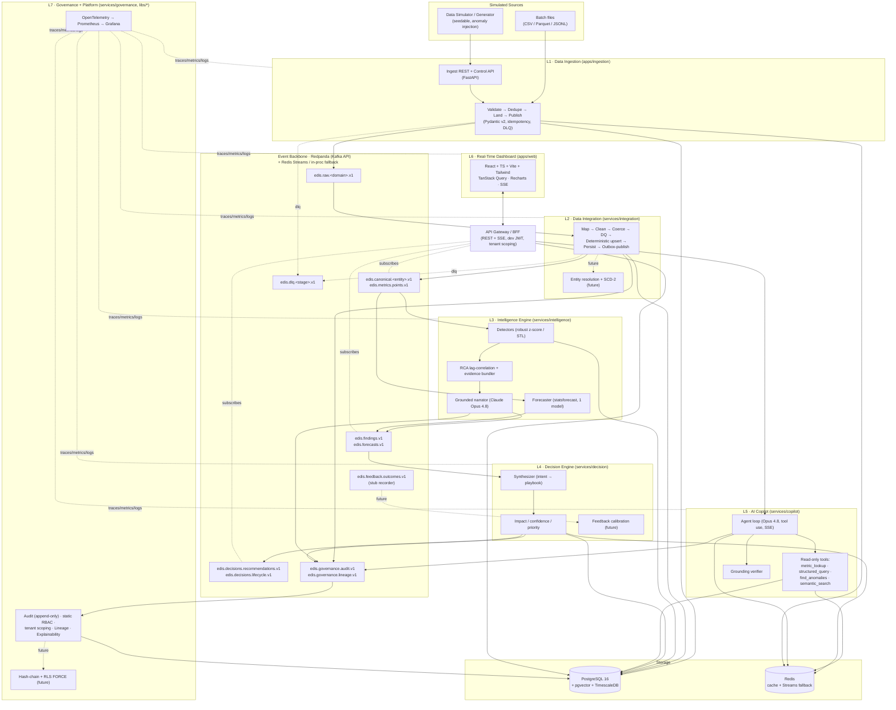

# Enterprise Decision Intelligence System (EDIS) — Architecture

> **Status:** Authoritative architecture of record. Synthesized by the Principal Engineer / Enterprise Architect from the seven layer designs. This document defines the **single canonical data model** and the **single shared event-topic schema set** that every layer uses. Where the independent layer designs disagreed, the conflicts are resolved here and this document wins.

**Document conventions**

- All timestamps are ISO-8601, UTC, tz-aware.
- Every persisted row and every event payload carries `tenant_id`.
- Schemas are expressed in Pydantic v2 (Python) on the backend and Zod (TypeScript) on the frontend, generated from the same canonical contracts.
- The LLM **never invents numbers.** Every figure surfaced to a user originates from a computed/retrieved fact with provenance.
- **MVP vs. designed-future.** This is a portfolio system built by one engineer in ~2 weeks. The architecture is designed end-to-end and enterprise-grade, but only a disciplined **vertical slice** is *built* in the MVP. Everything else is **designed, contract-defined, and interface-stubbed** so it can be added later without reshaping the system. Section 10 (Roadmap) is explicit about what is committed vs. deferred, and Section 5 tags each capability **[MVP]** or **[Designed — stub]**. The guiding principle (Section 1): *favor depth where it shows engineering judgment over breadth that cannot be finished.*

---

## Table of Contents

1. [Executive Summary](#1-executive-summary)
2. [High-Level Architecture](#2-high-level-architecture)
3. [End-to-End Data Flow](#3-end-to-end-data-flow)
4. [Canonical Unified Data Model & Event Topics](#4-canonical-unified-data-model--event-topics)
5. [Per-Layer Design](#5-per-layer-design)
6. [Cross-Cutting Concerns](#6-cross-cutting-concerns)
7. [Tech Stack](#7-tech-stack)
8. [Monorepo Repository Structure](#8-monorepo-repository-structure)
9. [End-to-End Demo Scenario](#9-end-to-end-demo-scenario)
10. [Phased Implementation Roadmap](#10-phased-implementation-roadmap)

---

## 1. Executive Summary

### The business problem

Enterprises run on fragmented, siloed data. Sales lives in the CRM, fulfillment in the ERP, reliability signals in operational logs, and behavior in product analytics. Each system has its own schema, its own identifiers, its own notion of "a customer." Because nothing is unified, decision-making is slow and retrospective: by the time a human stitches together a dashboard explaining last week's revenue dip, the window to act has closed. There is no real-time, explainable, *actionable* layer over the integrated business.

### How EDIS solves it

EDIS is a seven-layer platform that:

1. **Ingests** simulated-but-realistic sales, operations, and customer-activity data over both batch and real-time streams, validating every record at the edge.
2. **Integrates** that heterogeneous input into one clean, deduplicated, time-aware **canonical model** in PostgreSQL + TimescaleDB — the system of record everything else trusts.
3. **Runs an Intelligence Engine** that detects anomalies (robust z-score / STL), performs cross-dimensional root-cause analysis, and forecasts — all with classical, reproducible math, then attaches an LLM-generated narrative grounded strictly in the computed evidence.
4. **Runs a Decision Engine** that maps findings to prioritized, confidence-scored, explainable recommendations from a typed playbook.
5. **Exposes an AI Copilot** — a streaming, tool-using Claude agent that answers "Why did revenue drop?" / "What should we do?" by retrieving and computing over the canonical model, never by fabricating figures.
6. **Surfaces a Real-Time Dashboard** with live KPIs, an anomaly feed, ranked recommendations, and the copilot — over SSE.
7. **Enforces a Governance + Platform spine** — append-only audit log, RBAC, per-tenant scoping, data lineage, explainability storage, OpenTelemetry observability, and one-command deployment.

The result is a believable enterprise system that, with one `make up`, ingests seeded data, detects a revenue anomaly, explains the root cause with cited numbers, recommends a prioritized action, and answers natural-language questions about all of it — in real time, with a full audit trail.

### What is actually built in ~2 weeks (and what is not)

Depth is concentrated where engineering judgment shows: the **canonical contracts** (Section 4), the **AI grounding guarantee** (Sections 5.3, 5.5, 6), the **observability spine**, and the **demo**. The committed MVP is **one clean vertical slice**:

> **sales + ops ingest → canonical model + metric hypertable → STL / robust-z-score detection + lag-correlation RCA → one typed playbook recommendation → grounded copilot answer → live dashboard tile.**

The following are **designed, contract-defined, and stubbed behind their interfaces — but not built in the MVP**, and are listed as such (not as deliverables) in Section 10:

- Fuzzy **entity resolution** and full **SCD Type-2** history (MVP uses a deterministic id-keyed upsert; the SCD-2 columns exist but `is_current=true`/`valid_to=null` always).
- The **feedback / calibration loop** (the `OutcomeReport` contract + topic + a no-op recorder exist; EMA recalibration is future; `historical_calibration` uses a pre-seeded static prior).
- **Tamper-evident hash-chained audit** and **Postgres RLS `FORCE`** with a CI isolation test (MVP uses a plain append-only audit table + app-level tenant filtering + static RBAC).
- The **full forecasting stack** (MVP ships one statsforecast model used only to draw the forecast band; Prophet, the breach projector, and forecast-driven findings are future).
- **OIDC/PKCE**, the multiplexed WebSocket bridge with poll fallback, and **Playwright** e2e (MVP uses a dev-mode static JWT and SSE-only realtime).
- **Multi-tenancy enforcement tests**, K8s manifests, Kafka Connect, OPA.

A lightweight in-process / Redis-Streams fallback lets the whole thing run on a laptop without Redpanda. The deferred items do not change any contract or topic; they are additive behind ports that already exist.

---

## 2. High-Level Architecture

Solid edges and boxes are **[MVP]** (built). Dashed boxes/edges marked *future* are **[Designed — stub]**: the seam (contract, topic, or no-op processor) exists, the implementation is deferred.



**Reading the diagram.** Data flows top-to-bottom through the seven layers, mediated entirely by the event backbone and the shared storage. The **API Gateway / BFF** is the single edge for the frontend: it serves REST snapshots, bridges Kafka topics to the browser over **SSE** (one event stream per concern in the MVP; a multiplexed WebSocket is the deferred upgrade), proxies the Copilot stream, and enforces JWT + tenant scoping. Governance is horizontal — it consumes the `audit` and `lineage` topics every other layer emits, and its libraries (`libs/edis-platform`, `libs/edis-contracts`) are imported by all services.

---

## 3. End-to-End Data Flow

The system has two ingress paths that **converge** at the canonical layer: a low-latency **real-time path** and a bulk **batch path**. Both use the exact same normalization core (one code path, two ingress modes — no logic drift), so a record is processed identically regardless of how it arrived.

```mermaid
sequenceDiagram
    autonumber
    participant SRC as Source / Simulator
    participant L1 as L1 Ingestion
    participant BUS as Redpanda
    participant L2 as L2 Integration
    participant DB as PG + Timescale + pgvector
    participant L3 as L3 Intelligence
    participant L4 as L4 Decision
    participant GW as API Gateway / BFF
    participant L5 as L5 Copilot (Opus 4.8)
    participant L6 as L6 Dashboard
    participant L7 as L7 Governance

    Note over SRC,BUS: REAL-TIME PATH (per record, low latency)
    SRC->>L1: raw sales record (messy types)
    L1->>L1: validate@edge, coerce, dedupe (Redis SETNX), build IngestEnvelope
    L1->>DB: append raw_events (outbox)
    L1->>BUS: publish edis.raw.sales.v1 (key=tenant_id)
    L1->>BUS: publish edis.governance.audit.v1 (DATA_WRITE)
    BUS->>L2: consume edis.raw.sales.v1
    L2->>L2: map→clean→coerce→DQ→deterministic id-keyed upsert
    L2->>DB: upsert CanonicalOrder + MetricObservation (txn + outbox)
    L2->>BUS: publish edis.canonical.order.v1 + edis.metrics.points.v1
    L2->>BUS: publish edis.governance.lineage.v1
    BUS->>L3: consume edis.metrics.points.v1 (stream tap)
    L3->>DB: read window from metric hypertable
    L3->>L3: detect (robust z-score / STL) → score → correlate (lag-aware RCA)
    L3->>L3: build EvidenceBundle, narrate (Opus 4.8, grounded)
    L3->>DB: persist Finding (+ pgvector embedding via voyage-3)
    L3->>BUS: publish edis.findings.v1 (key=tenant:finding_id)
    BUS->>L4: consume edis.findings.v1
    L4->>L4: classify intent (Haiku 4.5) → playbook → impact/confidence/priority
    L4->>DB: persist Recommendation (txn + outbox)
    L4->>BUS: publish edis.decisions.recommendations.v1
    GW->>BUS: subscribe findings + recommendations + metrics
    GW-->>L6: SSE push (anomaly, recommendation, KPI tick)
    L6-->>L6: render live; user clicks "Why?"

    Note over SRC,DB: BATCH PATH (bulk, higher latency, same core)
    SRC->>L1: bulk CSV/Parquet (90 days seed)
    L1->>L1: chunked read, per-row validate, checkpoint
    L1->>BUS: publish edis.raw.*.v1 (good rows) / DLQ (bad rows)
    Note over L1,L3: From here the batch path is identical to the<br/>real-time path: L2 normalizes, L3 sweeps on a schedule<br/>(APScheduler) rather than reactively, L4 ranks.

    Note over L6,L5: COPILOT QUERY (grounded Q&A)
    L6->>GW: POST /copilot/chat "Why did revenue drop last week?"
    GW->>L5: authenticated, tenant-scoped request
    L5->>L5: route (Haiku 4.5): intent=rca, effort=high
    L5->>DB: tool: metric_lookup(revenue, weekly)
    L5->>DB: tool: find_anomalies(revenue, last_week)
    L5->>DB: tool: semantic_search(recommendations)
    L5->>L5: synthesize (Opus 4.8) over tool results only
    L5->>L5: grounding verifier: every number ↔ a tool result
    L5-->>GW: SSE stream (tokens + citations + usage)
    GW-->>L6: stream rendered answer with citations
    L5->>BUS: publish edis.governance.audit.v1 (AI_QUERY)
    L5->>L7: write Decision/Evidence (explainability)
```

**Real-time vs batch — the distinction.**

| Aspect | Real-time path | Batch path |
|---|---|---|
| Ingress | REST push / simulator stream | Chunked file loader (`dil seed`) |
| L1 publishing | Per-record to `edis.raw.*.v1` | Per-row, checkpointed by offset |
| L2 processing | aiokafka stream consumer | Same pipeline, bulk dispatch |
| L3 trigger | Reactive stream tap on `edis.metrics.points.v1` | Scheduled sweep (APScheduler) over the hypertable |
| Latency target | seconds | minutes (bounded by chunk size) |
| Convergence | **Both write the identical CanonicalOrder/MetricObservation rows.** Downstream (L3/L4/L5/L6) cannot tell which path produced a fact. |

---

## 4. Canonical Unified Data Model & Event Topics

This section is the contract of record. It supersedes the per-layer drafts. All names, keys, and payloads here are authoritative. **Every payload named in this section is concretely defined in `libs/edis-contracts` (mapped to a file in Section 8) — none are "follows the same pattern" prose.**

### 4.0 Conflict resolutions (from the layer drafts)

The independent designs proposed overlapping but inconsistent names. Resolved canonically:

| Concern | Drafts said | **Canonical decision** |
|---|---|---|
| Ingest output topic | `edis.ingest.sales.v1` (L1) vs `raw.crm.account` (L2) | **`edis.raw.<domain>.v1`** where `domain ∈ {sales, ops, customer}`. Source-system detail lives *inside* the envelope (`source_system`), not in the topic name. |
| Canonical change events | `canonical.order.created` (L2) vs implied by others | **`edis.canonical.<entity>.v1`**, one event type with an `op` field. **Time-retained change feed (7d) for all three entities** — see §4.3 keying note. |
| Metric stream | `metrics.points.v1` (L3) vs `canonical.metric.observed` (L2) | **`edis.metrics.points.v1`** (single dedicated high-volume series topic). |
| Findings topic | `findings.v1` (L3) vs `insights.ranked` (L4 consumed) | **`edis.findings.v1`** is the atomic detection L4 consumes. (The L4 draft's "InsightRef" maps 1:1 to a `Finding`.) A synthesized-rollup `edis.insights.v1` is **deferred**; the MVP surfaces findings directly. |
| Recommendations | `decisions.recommendations` (L4) vs `recommendations.ranked` (L6 consumed) | **`edis.decisions.recommendations.v1`**; the gateway bridges it to the browser. |
| Outcomes / feedback | `outcomes.recorded` (L4) vs `feedback.events` (L6) vs `decision.feedback.copilot` (L5) | **`edis.feedback.outcomes.v1`** (single topic; `source` field distinguishes human/system/copilot). **MVP: a no-op recorder persists `OutcomeReport`s; no calibration consumer.** |
| Audit / lineage | `governance.audit.v1` (L7) vs `intelligence.audit.v1` (L3) vs `governance.audit.copilot` (L5) | **`edis.governance.audit.v1`** (one topic, all producers; `action` enum distinguishes) and **`edis.governance.lineage.v1`**. |
| DLQ | `ingest.dlq` (L1) vs `dlq.<source>` (L2) | **`edis.dlq.<stage>.v1`** where `stage ∈ {ingest, integration}`. |

Topic naming convention: **`edis.<stage>.<name>.v1`**. Versioned suffix is mandatory; evolution is additive; consumers pin a version.

### 4.1 The ingestion envelope (L1 → L2 contract)

Every record entering the bus is wrapped in one envelope. This is the stable boundary between "untrusted source reality" and "the platform."

```python
# libs/edis-contracts/edis_contracts/ingest.py
from pydantic import BaseModel, Field
from datetime import datetime
from typing import Literal, Any
from uuid import UUID

Domain = Literal["sales", "ops", "customer"]

class IngestEnvelope(BaseModel):
    model_config = {"frozen": True, "extra": "forbid"}
    event_id: UUID                       # server-generated, unique per envelope
    idempotency_key: str                 # deterministic, replay-safe (see derivation)
    schema_ref: str                      # "sales.v1"
    domain: Domain
    tenant_id: str                       # multi-tenant partition key
    source_system: str                   # provenance: "crm-prod" | "erp" | "simulator"
    ingest_ts: datetime                  # when L1 received it (UTC)
    event_ts: datetime                   # business event time, normalized to UTC tz-aware
    producer: str = "ingestion"
    trace_context: dict[str, str] = Field(default_factory=dict)  # W3C traceparent
    is_synthetic: bool = True            # simulator flag (lineage/governance)
    anomaly_label: str | None = None     # ground truth when simulator injects (for eval)
    payload: dict[str, Any]              # validated, source-typed payload (per-domain model)
    schema_version: int = 1
```

`idempotency_key` derivation (deterministic): `sales` → `f"sales:{tenant_id}:{source_system}:{order_id}"`; `ops` → `sha256(f"{tenant_id}|{service}|{event_ts}|{message}|{trace_id}")`; `customer` → `f"customer:{tenant_id}:{session_id}:{event}:{event_ts.timestamp()}"` (content hash fallback when ids null).

Validated per-domain payloads (`SalesPayloadV1`, `OpsPayloadV1`, `CustomerPayloadV1`, also in `ingest.py`) coerce the messy source shapes (currency-as-string, epoch-ms-vs-ISO timestamps, etc.) and use `extra="forbid"` to catch drift at the edge.

### 4.2 Canonical core entities (the unified model)

Persisted in PostgreSQL. **MVP keying is deterministic:** `source_id` maps 1:1 to a `canonical_*_id` via a stable upsert; the SCD-2 columns (`valid_from`/`valid_to`/`is_current`/`version`) are present in the schema and contract but the MVP always writes `valid_to=null`, `is_current=true`, `version=1`. Fuzzy entity resolution and real SCD-2 history are designed and stubbed behind the `SourceRef`/crosswalk shape (see §5.2, Section 10 "Not built in MVP"). Every table carries `tenant_id`; the MVP filters by it at the application layer (Postgres RLS `FORCE` is deferred — see §5.7).

```python
# libs/edis-contracts/edis_contracts/canonical.py
from pydantic import BaseModel, EmailStr
from datetime import datetime
from decimal import Decimal
from uuid import UUID
from typing import Literal

class SourceRef(BaseModel):
    source_system: str
    source_id: str
    schema_version: int
    match_confidence: float = 1.0        # 1.0 under deterministic upsert; <1.0 once ER is built

class CanonicalCustomer(BaseModel):       # SCD-2-shaped dimension (history future)
    canonical_customer_id: UUID           # stable surrogate key (deterministic in MVP)
    tenant_id: str
    legal_name: str
    display_name: str
    primary_email: EmailStr | None
    country_iso2: str | None              # normalized ISO-3166-1 alpha-2
    industry: str | None
    region: str | None                    # NA | EMEA | APAC | LATAM
    valid_from: datetime
    valid_to: datetime | None = None      # null = current (always null in MVP)
    is_current: bool = True
    version: int = 1
    source_refs: list[SourceRef]
    dq_score: float                       # 0..1
    record_hash: str                      # content hash for idempotent upsert
    created_at: datetime
    updated_at: datetime

class CanonicalProduct(BaseModel):        # SCD-2-shaped dimension (history future)
    canonical_product_id: UUID
    tenant_id: str
    sku: str
    name: str
    category: str | None
    uom: str | None
    valid_from: datetime
    valid_to: datetime | None = None
    is_current: bool = True
    version: int = 1
    source_refs: list[SourceRef]
    record_hash: str

class CanonicalOrderLine(BaseModel):
    canonical_product_id: UUID
    sku: str
    qty: int
    unit_price_base: Decimal
    line_amount_base: Decimal

class CanonicalOrder(BaseModel):          # immutable fact
    canonical_order_id: UUID
    tenant_id: str
    canonical_customer_id: UUID
    order_ts: datetime                    # UTC event-time
    currency_base: Literal["USD"]
    amount_base: Decimal                  # normalized to base currency
    amount_src: Decimal
    currency_src: str
    fx_rate: Decimal
    region: str | None
    channel: Literal["web", "partner", "direct"] | None
    line_items: list[CanonicalOrderLine]
    source_refs: list[SourceRef]
    record_hash: str
    created_at: datetime

class OpsEvent(BaseModel):                # immutable fact — feeds error_rate / latency_p95
    canonical_ops_event_id: UUID
    tenant_id: str
    service: str                          # "checkout-api"
    region: str | None
    level: Literal["info", "warn", "error"]
    status_code: int | None
    latency_ms: float | None
    message: str | None
    event_ts: datetime
    source_refs: list[SourceRef]
    record_hash: str

class CustomerActivity(BaseModel):        # immutable fact — feeds page_views / sessions
    canonical_activity_id: UUID
    tenant_id: str
    canonical_customer_id: UUID | None
    session_id: str
    event: str                            # "page_view" | "add_to_cart" | "checkout_start"
    region: str | None
    channel: Literal["web", "partner", "direct"] | None
    props: dict[str, str]
    event_ts: datetime
    source_refs: list[SourceRef]
    record_hash: str

class MetricObservation(BaseModel):       # TimescaleDB hypertable: metric_observations
    tenant_id: str
    metric_key: str                       # "revenue" | "orders" | "error_rate" | "latency_p95" | "page_views"
    ts: datetime                          # hypertable time column (event-time)
    dimensions: dict[str, str]            # {"region":"EMEA","channel":"web"}
    value: float
    unit: str | None                      # "USD" | "count" | "ms" | "pct"
    source_refs: list[SourceRef]
```

### 4.3 Canonical event topics & payload schemas

| Topic | Producer → Consumer(s) | Key | Payload | Retention | MVP? |
|---|---|---|---|---|---|
| `edis.raw.sales.v1` | L1 → L2 | `tenant_id` | `IngestEnvelope` | 7d | **MVP** |
| `edis.raw.ops.v1` | L1 → L2 | `tenant_id\|service` | `IngestEnvelope` | 7d | **MVP** |
| `edis.raw.customer.v1` | L1 → L2 | `tenant_id\|session_id` | `IngestEnvelope` | 7d | stub seam |
| `edis.canonical.order.v1` | L2 → L3, GW | `canonical_order_id` | `CanonicalEvent` | 7d | **MVP** |
| `edis.canonical.customer.v1` | L2 → L3, GW | `canonical_customer_id` | `CanonicalEvent` | 7d | **MVP** |
| `edis.canonical.product.v1` | L2 → L3, GW | `canonical_product_id` | `CanonicalEvent` | 7d | stub seam |
| `edis.metrics.points.v1` | L2 → L3, GW | `tenant_id:metric_key:dim_hash` | `MetricPoint` | 7d | **MVP** |
| `edis.findings.v1` | L3 → L4, GW, L5-indexer | `tenant_id:finding_id` | `Finding` | 30d | **MVP** |
| `edis.forecasts.v1` | L3 → GW | `tenant_id:metric_key:dim_hash` | `Forecast` | 7d | **MVP** (band only) |
| `edis.decisions.recommendations.v1` | L4 → GW, L5 | `tenant_id` | `Recommendation` | 30d | **MVP** |
| `edis.decisions.lifecycle.v1` | L4 → GW, L7 | `recommendation_id` | `RecommendationLifecycleEvent` | 30d | **MVP** |
| `edis.feedback.outcomes.v1` | GW/L5/external → L4 | `recommendation_id` | `OutcomeReport` | 30d | seam + no-op recorder |
| `edis.governance.audit.v1` | **all** → L7 | `tenant_id` | `AuditEvent` | 90d | **MVP** |
| `edis.governance.lineage.v1` | L1/L2/L3/L4 → L7 | `tenant_id` | `LineageEvent` | 90d | **MVP** |
| `edis.dlq.ingest.v1` | L1 → replay tooling | `tenant_id` | `DLQRecord` | 30d | **MVP** |
| `edis.dlq.integration.v1` | L2 → replay tooling | original key | `QuarantinedRecord` | 30d | **MVP** |

**Retention / keying rationale (coherence note).** Every `canonical.*.v1` topic is a **time-retained change feed (7d)** carrying `op ∈ {created, updated, corrected}` — *not* a log-compacted snapshot store. This is deliberate: L3 and the copilot consume canonical changes as an **ordered change stream** keyed `canonical_*_id`, and compaction would drop intermediate values per key and give no cross-key ordering, breaking that contract. (If a current-state snapshot store is ever needed, it is a *separate* compacted topic, never an overload of these.) Keying on `tenant_id` (or `tenant:entity`) preserves per-tenant ordering and consumer-group parallelism; metric/forecast events key by `tenant:metric:dim_hash` so a single series stays ordered on one partition. These keying assumptions hold uniformly because no topic mixes change-feed and snapshot semantics.

Key payload schemas. **`schema_version` is `int = 1` on every payload, uniformly** (the contracts library enforces this; a generic reader can pull `schema_version` off any event without type drift):

```python
# edis_contracts/events.py  — edis.metrics.points.v1
class MetricPoint(BaseModel):
    tenant_id: str
    metric_key: str
    ts: datetime
    value: float
    dimensions: dict[str, str]
    unit: str | None = None
    source: str
    schema_version: int = 1

# edis_contracts/events.py  — edis.canonical.*.v1
class CanonicalEvent(BaseModel):
    event_id: UUID
    tenant_id: str
    entity: Literal["customer", "product", "order"]
    op: Literal["created", "updated", "corrected"]
    occurred_at: datetime
    emitted_at: datetime
    canonical_id: UUID
    before: dict | None = None
    after: dict | None = None
    lineage_run_id: UUID | None = None
    is_late: bool = False                # always False in MVP (no watermark reorder)
    correction_of: UUID | None = None
    schema_version: int = 1

# edis_contracts/events.py  — edis.governance.lineage.v1
class LineageEvent(BaseModel):
    lineage_id: UUID
    tenant_id: str
    run_id: UUID
    inputs: list[dict]                   # [{type, id}] e.g. raw_event, canonical_order
    outputs: list[dict]
    stage: str                           # "integration" | "intelligence" | "decision"
    occurred_at: datetime
    schema_version: int = 1

# edis_contracts/findings.py  — edis.findings.v1
class FindingKind(str, Enum):
    POINT_ANOMALY="point_anomaly"; SEASONAL_BREAK="seasonal_break"
    LEVEL_SHIFT="level_shift"; TREND_BREAK="trend_break"
    FORECAST_BREACH="forecast_breach"; ROOT_CAUSE="root_cause"

class CandidateCause(BaseModel):
    metric_key: str
    dimensions: dict[str, str]
    correlation: float                   # -1..1, lag-adjusted
    lag_minutes: int
    contribution_pct: float | None
    direction: Literal["leading", "coincident", "lagging"]
    observed_delta: float

class Finding(BaseModel):
    finding_id: UUID
    tenant_id: str
    kind: FindingKind
    metric_key: str
    dimensions: dict[str, str]
    window_start: datetime
    window_end: datetime
    detector: str
    detector_version: str
    observed_value: float                # computed — LLM never overrides
    expected_value: float
    deviation: float
    deviation_pct: float
    score: float                         # detector-native (z-score / residual)
    severity: float                      # 0..1 normalized
    confidence: float                    # 0..1
    business_impact_input: float         # 0..1 — Decision owns final ranking
    candidate_causes: list[CandidateCause] = []
    narrative: str | None = None         # grounded LLM text; null until narrated
    narrative_model: str | None = None   # "claude-opus-4-8"
    evidence_ref: UUID | None = None     # FK to persisted EvidenceBundle (audit)
    status: Literal["open","acknowledged","resolved","expired"] = "open"
    created_at: datetime
    schema_version: int = 1

# edis_contracts/findings.py  — edis.forecasts.v1
class Forecast(BaseModel):
    forecast_id: UUID
    tenant_id: str
    metric_key: str
    dimensions: dict[str, str]
    model: str                           # "statsforecast.AutoETS"
    horizon_days: int
    points: list[dict]                   # [{ts, yhat, yhat_lower, yhat_upper}]
    generated_at: datetime
    schema_version: int = 1

# edis_contracts/decisions.py  — edis.decisions.recommendations.v1
class ImpactEstimate(BaseModel):
    value: float; value_low: float; value_high: float
    unit: str; direction: Literal["increase","decrease","mitigate"]
    horizon_days: int
    inputs: dict[str, float]             # the retrieved facts used (auditable)
    method: str

class ConfidenceScore(BaseModel):
    value: float
    components: dict[str, float]         # {insight, evidence, historical_calibration}
    calibration_n: int                   # 0 in MVP (static prior); >0 once feedback loop is built

class Recommendation(BaseModel):
    recommendation_id: UUID
    tenant_id: str
    source_finding_id: UUID              # provenance back-link to the Finding
    playbook_id: str
    playbook_version: str
    title: str
    action_type: Literal["operational_fix","pricing_change","inventory_reallocation",
                         "customer_outreach","investigate","scale_resource","notify"]
    action_params: dict[str, Any]
    impact: ImpactEstimate
    effort_tier: Literal["xs","s","m","l","xl"]
    confidence: ConfidenceScore
    priority_score: float                # (impact.value * confidence.value) / effort_units
    priority_rank: int
    explanation_summary: str
    evidence_trail: list[dict]           # links: finding, metrics, root_causes, playbook_rule
    narrative: str | None = None         # optional Opus 4.8 prose; never numeric authority
    status: Literal["proposed","accepted","rejected","expired","in_progress","outcome_recorded"]
    expires_at: datetime
    created_at: datetime
    schema_version: int = 1              # int, matching every other payload

# edis_contracts/decisions.py  — edis.decisions.lifecycle.v1
class RecommendationLifecycleEvent(BaseModel):
    event_id: UUID
    tenant_id: str
    recommendation_id: UUID
    from_status: str | None
    to_status: str
    actor: dict                          # {type, id}
    occurred_at: datetime
    schema_version: int = 1

# edis_contracts/decisions.py  — edis.feedback.outcomes.v1 (seam; recorder is no-op in MVP)
class OutcomeReport(BaseModel):
    outcome_id: UUID
    tenant_id: str
    recommendation_id: UUID
    source: Literal["human","system","copilot"]
    accepted: bool
    realized_value: float | None = None  # populated by future feedback loop
    realized_unit: str | None = None
    notes: str | None = None
    occurred_at: datetime
    schema_version: int = 1

# edis_contracts/governance.py  — edis.governance.audit.v1
class AuditEvent(BaseModel):
    audit_id: UUID                       # idempotency key
    occurred_at: datetime
    tenant_id: str
    actor: dict                          # {type, id, roles}
    action: Literal["DATA_READ","DATA_WRITE","AI_DECISION","AI_QUERY",
                    "AUTH_DENY","RBAC_CHANGE","EXPORT"]
    resource: dict                       # {type, id, columns?}
    outcome: Literal["ALLOW","DENY","ERROR"]
    reason: str | None = None
    decision_id: UUID | None = None      # link to explainability for AI_*
    trace_id: str | None = None
    schema_version: int = 1
```

Also defined in `libs/edis-contracts`: `DLQRecord` and `QuarantinedRecord` (`ingest.py`), `EvidenceBundle` (`findings.py`), `Decision` / `Evidence` explainability records (`governance.py`), and `SecurityContext` / `Actor` / `ResourceRef` (`security.py`). Every payload named in this section maps to a concrete file in Section 8.

**The contracts library is load-bearing.** `libs/edis-contracts` is the single source of truth; every service imports it, so a breaking schema change fails type-checking across all dependents in CI (intentional). A golden-JSON stability test (`F6`) catches accidental field/type drift — including the kind of `int`-vs-`str` `schema_version` mismatch this section eliminates.

---

## 5. Per-Layer Design

Concise, de-duplicated. Each capability is tagged **[MVP]** (built in the ~2-week slice) or **[Designed — stub]** (contract/seam present, implementation deferred — see Section 10). Cross-cutting machinery shared by all layers lives in Section 6 and is not repeated per layer.

### 5.1 L1 — Data Ingestion (`apps/ingestion`)

The **edge of trust**: the only component permitted to accept untrusted source data. Guarantees *structural validity, source fidelity, and at-least-once delivery with idempotency* — but **not** semantic correctness across sources (that is L2's job).

- **[MVP] Connectors / Simulator / Batch Loader.** A `SourceConnector` protocol (`async iter_records()`) with a seedable, deterministic simulator that produces correlated, realistic sales + ops data (weekly seasonality, region/channel mix, ops-latency↔error-rate correlation) and supports **injectable anomaly profiles** (`spike`, `drop`, `drift`, `outage`) with `anomaly_label` ground truth for eval. Batch loader streams CSV/Parquet/JSONL chunked + checkpointed. (Customer-activity connector is a stub seam in the MVP.)
- **[MVP] Pipeline.** `validate@edge (Pydantic v2) → idempotency guard (Redis SETNX) → envelope builder → raw landing writer (outbox) → producer`. Bad records route to `edis.dlq.ingest.v1` with full error context; never block the partition. Outbox pattern: write `raw_events` before publish ack, so a broker outage cannot lose a record (reconcile job republishes).
- **[MVP] Sinks.** `EventSink` protocol with `kafka` (aiokafka → Redpanda), `redis` (Redis Streams fallback), and `inproc` (tests/laptop) backends, selected by `SINK_BACKEND`. Downstream is identical regardless.
- **[MVP] APIs.** `POST /v1/ingest/{sales|ops}` (single or batch, `207` partial success); `POST /v1/control/simulator/{start|stop|inject}` and `/v1/control/seed` — the demo's remote control; live `/inject` makes an anomaly appear downstream with ground-truth labeling.
- **Produces:** `edis.raw.*.v1`, `edis.dlq.ingest.v1`, `edis.governance.audit.v1`.

### 5.2 L2 — Data Integration (`services/integration`)

The **system-of-record gatekeeper**: *"garbage may enter the raw topic; only canonical, validated, lineage-tagged facts leave."* Deterministic and reproducible — **no LLM**.

- **[MVP] Normalization pipeline (one core, two ingress modes).** Per record: `decode → validate-source (per-domain model) → map (versioned SourceMapper) → clean (trim/case, currency→base+FX, ISO codes, date parsing) → coerce → DQ-check → upsert`.
- **[MVP] Deterministic identity.** The simulator emits already-keyed `source_id`s; L2 maps each 1:1 to a stable `canonical_*_id` via an idempotent `ON CONFLICT` upsert and records a `SourceRef` (`match_confidence=1.0`). The full **crosswalk** shape exists in the contract.
- **[Designed — stub] Entity resolution + SCD-2 history.** Classical-first ER (blocking → pgvector candidate gen → `rapidfuzz` survivorship → `needs_review` gray-zone) and SCD-2 versioning (`valid_from`/`valid_to`/`is_current`/`version` mutate over time) are designed against the same `CanonicalCustomer`/`SourceRef` shapes. **Not built in MVP** — the seam (crosswalk table, `match_confidence`, SCD-2 columns) is present so it slots in without a schema change. The LLM never decides identity.
- **[Designed — stub] Late/out-of-order handling.** Event-time watermarks + reorder buffer and the `op="corrected"`/`correction_of` correction path are designed; the MVP processes in arrival order (`is_late` always `False`).
- **[MVP] Persistence + outbox.** Canonical facts to Postgres; `MetricObservation` rows to the Timescale hypertable with hourly/daily **continuous aggregates** for rollups. Canonical row + outbox event committed in one transaction → the relay publishes `edis.canonical.*.v1` and `edis.metrics.points.v1`. No "persisted-but-not-published" gap.
- **[MVP] Invariant:** every input record terminates in exactly one of {canonical store, quarantine} — never silently dropped, never double-counted.
- **Produces:** `edis.canonical.*.v1`, `edis.metrics.points.v1`, `edis.dlq.integration.v1`, `edis.governance.lineage.v1`.

### 5.3 L3 — Intelligence Engine (`services/intelligence`)

Turns clean metrics into *computed, grounded facts about what changed, why, and what's next.* The only layer permitted to run statistical detection, RCA, and forecasting.

- **[MVP] Detection — classical first.** Pluggable `Detector` protocol: robust z-score (median/MAD) for point anomalies and **STL** (statsmodels) for seasonal/trend breaks (level-shift detection on the STL residual). Detectors are stateless per window → runnable both reactively (stream tap on `edis.metrics.points.v1`) and on a scheduled batch sweep (APScheduler). **[Designed — stub]** IQR and `ruptures` changepoint detectors plug into the same protocol later.
- **[MVP] RCA.** A lag-aware correlation engine finds co-occurring anomalies across related metrics/dimensions within a time window, computes lag-adjusted correlation + dimensional contribution, and ranks `CandidateCause`s. The **evidence bundler** assembles the *only* thing the LLM may reason over.
- **[MVP] Forecasting (band only).** One `statsforecast` model (AutoETS) emits point + prediction interval per metric, used to draw the dashboard forecast band. **[Designed — stub]** Prophet, the per-metric model selector, the breach projector, and `FORECAST_BREACH` findings are deferred (the `Forecast` contract and `edis.forecasts.v1` topic already support them).
- **[MVP] Grounded narration.** `claude-opus-4-8` (adaptive thinking, `effort=high`, `thinking.display="summarized"`, streamed) writes the RCA narrative over the `EvidenceBundle` only; `claude-haiku-4-5` (structured outputs) does cheap classification (anomaly-type labeling). Embeddings via **Voyage `voyage-3`** into pgvector for Copilot retrieval. **Grounding guard:** every numeric token in the narrative must match a value present in the evidence bundle (tolerance check) or the narrative is discarded and a deterministic template is used. Detection never depends on the LLM — findings persist with `narrative=null` if Claude is unavailable, narrated later via a retry queue.
- **[MVP] Scoring.** Normalized `severity`, `confidence`, and `business_impact_input` (magnitude × direction × reach) — L3 supplies the *input*; L4 owns the final business ranking.
- **Produces:** `edis.findings.v1`, `edis.forecasts.v1`, `edis.governance.audit.v1`.

### 5.4 L4 — Decision Engine (`services/decision`)

Answers *"what should we do?"* Consumes `edis.findings.v1`; produces prioritized, explainable, confidence-scored recommendations.

- **[MVP] Synthesis.** `claude-haiku-4-5` (structured output, constrained enum) maps a finding to a `playbook_intent`; the **Playbook Resolver** binds the matching typed `ActionTemplate` to the finding's entities. Falls back to deterministic rule-based mapping if the classifier is unavailable. The MVP ships **one fully-built playbook** (`operational_fix`); the registry holds typed stubs for the others.
- **[MVP] Impact / confidence / priority — deterministic.** A `FactRetriever` pulls numeric inputs (current value, baseline, affected counts) from Postgres/Timescale/Redis; a per-template **estimator function** (closed-form rule) produces an `ImpactEstimate` with explicit, auditable `inputs`. `ConfidenceScore` blends finding confidence, evidence completeness, and a **pre-seeded static per-(tenant,playbook) calibration prior** (so `historical_calibration` has a believable value without a live loop; `calibration_n=0`). `priority_score = (impact.value × confidence.value) / effort_units`, normalized per tenant. **All numbers come from unit-tested code, never the LLM** (Opus 4.8 only writes optional narrative prose, post-validated against `impact.inputs`).
- **[MVP] Lifecycle (minimal).** `proposed → accepted/rejected/expired`; illegal transitions rejected (`409`); TTL sweeper expires stale recommendations. Every transition emits `edis.decisions.lifecycle.v1` + an audit event. **[Designed — stub]** the `in_progress → outcome_recorded` tail and a full FSM are deferred.
- **[Designed — stub] Feedback / calibration loop.** The `OutcomeReport` contract, the `edis.feedback.outcomes.v1` topic, and a **no-op outcome recorder** (persists outcomes, computes nothing) are present so the learning path is *demonstrably wired*. The realized-vs-predicted error computation and bounded-EMA recalibration are **not built in MVP** — they cannot be meaningfully exercised or validated against simulated outcomes in the time available, and the static prior gives the demo a believable confidence breakdown without them.
- **Produces:** `edis.decisions.recommendations.v1`, `edis.decisions.lifecycle.v1`, `edis.governance.audit.v1`. **Consumes:** `edis.findings.v1`, `edis.feedback.outcomes.v1` (recorder only).

### 5.5 L5 — AI Copilot (`services/copilot`)

A **grounded reasoning surface**, not a data source. A streaming, tool-using Claude agent that answers NL questions by retrieving and computing over the canonical model.

- **[MVP] Agent loop (manual, not the SDK runner).** `claude-haiku-4-5` routes/classifies the question (`{intent, entities, time_range, scope_ok}`); then `claude-opus-4-8` (adaptive thinking, `display:"summarized"` set explicitly so the UI can show a reasoning trace, `effort=high`, streamed at `max_tokens≈64000`) runs the plan→tool→synthesize loop with hard iteration and budget caps. The manual loop gives per-iteration OTel spans, budget checks, server-side tenant injection, and SSE emission. (Note: `effort` is set on the Opus call only — Haiku does not accept the `effort` parameter and is used purely for cheap structured routing/classification.)
- **[MVP] Tools (read-only, tenant injected server-side).** `metric_lookup`, `structured_query`, `find_anomalies`, `semantic_search` (hybrid pgvector + filters, query embedded at request time via `voyage-3`). A `forecast` tool is a **[Designed — stub]** seam pending the broader forecasting stack. Tool order is **frozen** so the tool schemas + system prefix are prompt-**cached** (`cache_control: ephemeral`). On Opus 4.8 the minimum cacheable prefix is **4096 tokens**, so the frozen tool schemas + system prefix are sized above that threshold; cache effectiveness is asserted via `usage.cache_read_input_tokens > 0` after warm-up, surfaced as the `cache hit ratio` metric.
- **[MVP] Grounding guarantee.** After synthesis, the **grounding verifier** extracts every numeric claim and asserts each maps to a value returned by a tool *this turn*; unmatched figures trigger one re-prompt, then are stripped and `confidence` is lowered. The model receives only tool results — it cannot fetch or fabricate.
- **[MVP] Safety / robustness.** Checks `stop_reason` before reading content (handles `refusal`, `max_tokens`, `max_iterations`); per-tool timeout + circuit breaker; per-tenant daily cost cap. Retrieved content is treated as data, never instructions; all tools are read-only, so prompt injection cannot trigger an action.
- **Produces:** SSE answer stream (tokens, tool-call trace, citations, usage), persisted `CopilotAnswer`, `edis.governance.audit.v1` (`AI_QUERY`). **[Designed — stub]** thumbs-up/down emitting `edis.feedback.outcomes.v1` linked to cited recommendation ids (the recorder accepts it; no learning consumes it). **Reads:** Postgres + pgvector via tools.

### 5.6 L6 — Real-Time Dashboard (`apps/web`)

Read-mostly presentation + a small write surface. Visualizes computed facts; never computes, never calls Claude/DB directly.

- **[MVP] Stack.** React 18 + TS + Vite + Tailwind + TanStack Query v5 (cache that realtime events patch via `setQueryData`) + Recharts. Zod validates every boundary payload (generated from the Pydantic contracts; CI fails on drift — this `Zod`-drift check is cheap and high-signal, so it stays in the MVP).
- **[MVP] Realtime — SSE only.** A single `RealtimeProvider` opens SSE streams to the gateway (`/stream/metrics`, `/stream/anomalies`, `/stream/recommendations`) with heartbeat + exponential-backoff reconnect; on reconnect it refetches REST snapshots to close the gap. Copilot answers stream over SSE with token/citation/tool-trace frames. SSE alone fully covers the live demo. **[Designed — stub]** the multiplexed WebSocket bridge and the SSE→poll fallback are deferred.
- **[MVP] Views.** One **Overview page** (`KpiGrid` live tiles + sparklines, `AnomalyFeed` with drill-in to RCA, one `RecommendationCard` with confidence gauge + explainability accordion + accept/reject) plus a `ForecastChart` (actual vs forecast band) and the `CopilotPanel` (citations + "grounded facts" chips). **[Designed — stub]** the `RecommendationBoard`, virtualized feed, and RBAC-gated `AuditView` are deferred.
- **[MVP] AuthN.** Dev-mode **static JWT** (a tenant/role chosen at app start) so the gateway's tenant scoping and RBAC are exercised end-to-end. **[Designed — stub]** OIDC Authorization-Code + PKCE + silent refresh.
- **[MVP] Guarantee, restated at the UI:** numbers shown for AI output come **only** from `citations`/`evidence`/`facts_used` fields — the UI never renders free-text numbers from an LLM narrative as authoritative metrics.
- **Consumes:** gateway REST + SSE. **Produces:** copilot questions, recommendation accept/reject (via the gateway).

### 5.7 L7 — Governance + Platform (`services/governance`, `libs/*`)

The spine that makes every layer trustworthy and runnable. Never computes business facts.

- **[MVP] Audit (append-only).** Drains `edis.governance.audit.v1` into a TimescaleDB hypertable, idempotent on `audit_id`. DENY decisions are written synchronously before the request proceeds; everything else is fire-and-forget (so auditing never blocks the request path). **[Designed — stub]** the tamper-evident **hash chain** (`row_hash = H(prev_hash ‖ canonical(row))`), periodic sealing, and `/audit/verify` are deferred to avoid front-loading a hard subsystem before any data flows. The `AuditEvent` contract is unchanged either way.
- **[MVP] RBAC + tenant scoping.** OIDC/JWT (dev static token in MVP) validated once in `libs/edis-platform/authz` → a `SecurityContext`. **Static table-driven RBAC** evaluated as a pure function (`evaluate(ctx, action, resource)`); tenant comes only from the verified token. Data-tier isolation is **application-level tenant filtering** (`WHERE tenant_id = :ctx`) carried through every repository. **[Designed — stub]** Postgres **Row-Level Security (`FORCE`)** keyed on `app.tenant_id`, the CI `test_rls_isolation` cross-tenant test, and Redis pub/sub RBAC-cache invalidation are deferred — RLS session-var plumbing through async SQLAlchemy + outbox relay + consumers is notoriously fiddly and would make every service harder to bring up. `tenant_id` stamping (cheap and correct) is everywhere from the first write; only `FORCE` enforcement is deferred.
- **[MVP] Lineage.** Consumes `edis.governance.lineage.v1`, materializes a `lineage_edge` graph for "why is this number what it is" queries from raw event → canonical → metric → finding → decision.
- **[MVP] Explainability store.** `Decision → Evidence[]` records (written by L3/L4/L5) where each `Evidence` stores an **immutable value snapshot** plus the live `ref` — so a narrative is reproducible even if the source mutates. pgvector on evidence for "similar past decisions."
- **[MVP] Platform SDK.** `libs/edis-contracts` (all shared Pydantic models), `libs/edis-platform` (settings, OTel bootstrap, JSON logging, tenant-scoped DB session, JWT/RBAC), `libs/edis-governance-sdk` (`emit_audit`, `emit_lineage`, `write_decision`). Owns `docker-compose.yml`, `Makefile`, CI.

### 5.8 API Gateway / BFF (`services/gateway`)

The single frontend edge (resolves the L5/L6 "who talks to whom" overlap). Stateless FastAPI: validates JWT → `SecurityContext`, scopes every request to the tenant, serves REST snapshots (`/kpis`, `/anomalies`, `/recommendations`, `/forecasts`), proxies the copilot SSE stream, and **bridges** `edis.canonical.*`, `edis.metrics.points`, `edis.findings`, and `edis.decisions.*` topics to the browser over **SSE** (one stream per concern). It is the authoritative authorization boundary; the React role guards are UX only. **[Designed — stub]** an `/audit` snapshot route and the multiplexed-WebSocket transport.

---

## 6. Cross-Cutting Concerns

### Security & RBAC

- **[MVP] AuthN:** A dev-mode static JWT carries `{tenant_id, user_id, roles, scopes}`; it is validated server-side in one shared dependency (`libs/edis-platform/authz/jwt.py`) → `SecurityContext`. Tenant and roles come **only** from the verified token, never request body or model input. **[Designed — stub]** OIDC Authorization-Code + PKCE in the SPA (access token in memory, silent refresh).
- **[MVP] AuthZ:** Static table-driven RBAC evaluated as a pure function (`evaluate(ctx, action, resource)`). Roles: `viewer`, `analyst`, `operator`, `auditor`, `admin`. **[Designed — stub]** Redis-cached RBAC with pub/sub invalidation; DB-re-checked sensitive scopes (`pii:read`, `export`).
- **[MVP] Defense in depth (app tier):** app-level RBAC + per-repository `tenant_id` filtering. Copilot tools inject tenant server-side and are strictly read-only — prompt injection can at most mislead a citation, never take an action or cross tenants. **[Designed — stub]** Postgres RLS `FORCE` as the data-tier guarantee.

### Multi-tenancy

`tenant_id` is stamped at the ingestion edge and carried through every envelope, every canonical row, every event key, every audit entry. Partitioning by `tenant_id` gives per-tenant ordering; **MVP isolation is application-level filtering.** Stateless services scale horizontally; all state (crosswalk, outbox, calibration prior) lives in Postgres/Redis. **[Designed — stub]** Postgres RLS `FORCE` + a CI cross-tenant isolation test are the deferred data-tier guarantee.

### Observability (OpenTelemetry)

A W3C `traceparent` is created at ingestion and **propagated in the `IngestEnvelope` and every downstream event**, so a single record is traceable across all seven layers. Each pipeline stage in every service is an OTel span carrying `tenant_id`, `trace_id`, and stage-specific attributes. Metrics → Prometheus → Grafana (ingest rate & DLQ rate, consumer lag, detection latency, narration fallback rate, `llm_tokens_total{model}`, `cache hit ratio`, grounding pass rate). Structured JSON logs are correlated by `trace_id` and include the Anthropic `_request_id` on every LLM call. PII is redacted by the shared log formatter. **[Designed — stub]** `rls_context_missing_total` and `hashchain_broken_total` alerts arrive with their respective subsystems.

### Governance / Audit / Explainability

Every data access and AI decision emits an `AuditEvent`; the **MVP audit log is append-only and tenant-scoped**. Every AI decision links to a `Decision`+`Evidence[]` explainability record with immutable value snapshots and a lineage back-pointer — answering "who did what, why, and where did this number come from." Lineage edges trace raw → canonical → metric → finding → recommendation. **[Designed — stub]** hash-chain tamper-evidence + `/audit/verify`.

### The feedback loop (advanced feature — designed, seam present, not built)

The learning path is **wired but inert** in the MVP: `Recommendation` (L4) → human/copilot acts → `OutcomeReport` on `edis.feedback.outcomes.v1` → a **no-op processor records the outcome**. The realized-vs-predicted error computation and per-`(tenant, playbook)` bounded-EMA recalibration that would close the loop are **future work** — they cannot be meaningfully exercised against simulated outcomes in the demo window. To keep the confidence breakdown believable without a live loop, `ConfidenceScore.components.historical_calibration` reads a **pre-seeded static prior** (`calibration_n=0`). This is the mechanism by which EDIS *will* "learn from action outcomes"; the contract and topic are stable so the consumer drops in without reshaping anything.

### The unbreakable AI rules (apply to L3, L4, L5)

1. **The LLM never invents numbers.** All figures are computed/retrieved facts with provenance; narratives are post-validated against the evidence and discarded on mismatch.
2. **Detection/decision never depend on the LLM.** Statistical results and deterministic scores are always available; the LLM only adds narrative, which degrades gracefully to templates.
3. **The LLM only reasons over tenant-scoped, computed evidence** passed explicitly into context — never raw PII, never cross-tenant data.

---

## 7. Tech Stack

| Component | Technology | Rationale |
|---|---|---|
| Backend language/runtime | Python 3.12, fully `async` | Mandated; async fits IO-bound producers/consumers + FastAPI. |
| API framework | FastAPI + Uvicorn, Pydantic v2 | Mandated; native Pydantic, OpenAPI, SSE via `StreamingResponse`; Pydantic v2 is the contract source of truth. |
| ORM / DB access | SQLAlchemy 2.x async + asyncpg | Mandated; async transactional upserts, `ON CONFLICT` idempotency. |
| Event backbone | Redpanda (Kafka API) via aiokafka | Mandated canonical; real partitioning/replay/consumer-groups, single container for demo. |
| Fallback bus | Redis Streams / in-proc | Mandated laptop fallback behind one `EventSink`/`MessageSource` port; zero downstream change. |
| Relational + vector + time-series | PostgreSQL 16 + pgvector + TimescaleDB | Mandated; one engine for canonical entities, embeddings (RAG), and metric hypertables + continuous aggregates. |
| Cache / dedupe / fallback queue | Redis | Mandated; idempotency `SETNX`, fact/narrative cache, Streams fallback. |
| Stream/ETL processing | aiokafka consumers (real-time) + chunked batch jobs | Mandated; one normalization core, two ingress modes. |
| Anomaly detection | statsmodels (STL), numpy (robust z-score) | Classical-first per mandate: cheap, explainable, reproducible, no training. (IQR/`ruptures` are designed extensions.) |
| Forecasting | statsforecast (AutoETS) — one model for the band | Mandated family; Prophet + per-metric selection + breach projector are designed-future. |
| Copilot reasoning / RCA narrative / recommendation prose | **Claude `claude-opus-4-8`** (1M ctx; $5/$25 per MTok; 128K max output; adaptive thinking; `effort` low→max) | Mandated lead model; long context for evidence, strong tool use + agentic reasoning; streamed with `max_tokens≈64000`; `thinking.display="summarized"` set explicitly. |
| Routing / classification / extraction | **Claude `claude-haiku-4-5`** (200K ctx; $1/$5 per MTok; 64K max output; structured outputs) | Mandated cheap model; one pre-flight route + intent classification keeps the expensive loop focused. (Haiku does not support `effort`.) |
| Embeddings | Voyage AI `voyage-3` → pgvector | Mandated; query embedded at request time, corpus embeddings written by L3. |
| Anthropic SDK usage | Official `anthropic` async SDK; manual agent loop; prompt caching (`cache_control: ephemeral`, ≥4096-token prefix on Opus 4.8); `messages.count_tokens` for budgeting | Per-mandate grounding discipline + cost control; frozen tool order for cache hits. |
| Frontend | React + TypeScript + Vite + Tailwind + TanStack Query + Recharts + Zod | Mandated; fast HMR, cache that realtime events patch, runtime boundary validation. |
| Realtime transport | SSE (MVP — metrics, anomalies, recommendations, copilot tokens) | Proxy-friendly, natural for token streaming; multiplexed WebSocket + poll fallback are designed-future. |
| Observability | OpenTelemetry → Prometheus + Grafana; structured JSON logs | Mandated; one tracer/logger bootstrap in `libs/edis-platform`. |
| AuthN/Z | Dev JWT + static table-driven RBAC (MVP); OIDC/JWT + Postgres RLS designed-future | Mandated layered model; MVP exercises the seam, hardening deferred. |
| Packaging / deploy | Docker + docker-compose (one-command up), Makefile, `.env.example`; K8s noted as future | Mandated; `make up` brings up the full topology incl. fallback flag. |
| Quality | pytest + httpx + testcontainers (backend), vitest + MSW (frontend), ruff/mypy/black, pre-commit, GitHub Actions CI | Mandated; contract tests gate breaking schema changes; Playwright + RLS-isolation test are designed-future. |
| Repo | Monorepo (`apps/*`, `services/*`, `libs/*`) | Mandated; shared contracts library makes interfaces load-bearing. |

---

## 8. Monorepo Repository Structure

The full enterprise structure is shown so the system has room to grow. **Files/directories that belong to a [Designed — stub] capability are marked `(future)`** — they are not created in the MVP but the layout reserves their place.

```text
edis/
├── docker-compose.yml                      # full topology: postgres-timescale, redis, redpanda,
│                                           #   all services, otel-collector, prometheus, grafana
├── Makefile                                # make up / down / seed / test / lint / demo
├── .env.example
├── .pre-commit-config.yaml
├── .github/
│   └── workflows/
│       └── ci.yml                          # ruff+mypy+black, pytest (testcontainers), vitest, contract + Zod-drift checks
├── README.md
├── docs/
│   └── ARCHITECTURE.md                     # (this document)
│
├── libs/                                   # shared platform SDK — imported by every service
│   ├── edis-contracts/                     # SINGLE SOURCE OF TRUTH for all schemas
│   │   ├── pyproject.toml
│   │   ├── edis_contracts/
│   │   │   ├── ingest.py                   # IngestEnvelope, Sales/Ops/CustomerPayloadV1, DLQRecord, QuarantinedRecord
│   │   │   ├── canonical.py                # CanonicalCustomer/Product/Order(+Line), OpsEvent, CustomerActivity, MetricObservation, SourceRef
│   │   │   ├── events.py                   # CanonicalEvent, MetricPoint, LineageEvent
│   │   │   ├── findings.py                 # Finding, FindingKind, CandidateCause, EvidenceBundle, Forecast
│   │   │   ├── decisions.py                # Recommendation, ImpactEstimate, ConfidenceScore, RecommendationLifecycleEvent, OutcomeReport
│   │   │   ├── governance.py               # AuditEvent, Decision, Evidence
│   │   │   └── security.py                 # SecurityContext, Actor, ResourceRef
│   │   └── tests/test_schema_stability.py  # golden-JSON drift test (catches int/str schema_version drift)
│   ├── edis-platform/
│   │   ├── pyproject.toml
│   │   └── edis_platform/
│   │       ├── settings.py                 # pydantic-settings, .env driven
│   │       ├── logging.py                  # JSON formatter + trace correlation + PII redaction
│   │       ├── otel.py                     # tracer/meter/log provider bootstrap
│   │       ├── db/
│   │       │   ├── session.py              # async engine + tenant-scoped session dependency
│   │       │   └── rls.py                  # (future) SET LOCAL app.tenant_id helpers for RLS FORCE
│   │       ├── authz/
│   │       │   ├── jwt.py                  # JWT -> SecurityContext (dev static token in MVP)
│   │       │   ├── rbac.py                 # pure evaluate(ctx, action, resource)
│   │       │   └── deps.py                 # FastAPI deps: get_ctx(), require_scope()
│   │       ├── bus/
│   │       │   ├── base.py                 # EventSink / MessageSource ports
│   │       │   ├── kafka.py                # aiokafka (Redpanda) impl
│   │       │   ├── redis_streams.py        # fallback impl
│   │       │   └── inproc.py               # tests/laptop impl
│   │       └── errors.py                   # typed exceptions -> RFC 9457 responses
│   ├── edis-governance-sdk/
│   │   └── edis_gov_sdk/
│   │       ├── audit.py                    # emit_audit()
│   │       ├── lineage.py                  # emit_lineage()
│   │       └── explain.py                  # write_decision()
│   └── edis-ts-contracts/                  # Zod schemas generated from edis-contracts (CI drift-checked)
│       └── src/{ingest,canonical,findings,decisions,governance}.ts
│
├── apps/
│   ├── ingestion/                          # L1
│   │   ├── pyproject.toml · Dockerfile · README.md
│   │   ├── migrations/                     # Alembic: raw_events, ingest_dlq, ingest_checkpoint
│   │   ├── src/ingestion/
│   │   │   ├── config.py · app.py · cli.py # cli: seed / stream / replay-dlq
│   │   │   ├── connectors/{base,sales,ops}.py   # customer.py (future)
│   │   │   ├── simulator/{generator,seasonality,anomalies,scenarios}.py
│   │   │   ├── pipeline/{validator,envelope_builder,idempotency,dlq}.py
│   │   │   ├── storage/{models,raw_writer}.py
│   │   │   ├── batch/{loader,readers}.py
│   │   │   └── api/{routes_ingest,routes_control,routes_health}.py
│   │   └── tests/{unit,integration,contract}/
│   └── web/                                # L6
│       ├── index.html · vite.config.ts · tsconfig.json · package.json · .env.example
│       ├── src/
│       │   ├── main.tsx · App.tsx · routes.tsx
│       │   ├── app/{AppShell,TenantSwitcher,ErrorBoundary}.tsx
│       │   ├── auth/{AuthProvider,useAuth,RequireRole}.tsx   # oidc.tsx (future)
│       │   ├── api/{client,endpoints,errors}.ts
│       │   ├── realtime/{RealtimeProvider,sseClient,events,useSubscription}.ts
│       │   ├── schemas/{kpi,anomaly,recommendation,forecast,copilot}.ts
│       │   ├── query/{useKpis,useAnomalies,useRecommendations,useForecast,useCopilot}.ts
│       │   ├── features/
│       │   │   ├── kpis/{KpiGrid,KpiCard,Sparkline}.tsx
│       │   │   ├── anomalies/{AnomalyFeed,AnomalyRow,RootCausePanel}.tsx
│       │   │   ├── recommendations/{RecommendationCard,ConfidenceGauge,ExplainabilityAccordion}.tsx
│       │   │   ├── forecast/ForecastChart.tsx
│       │   │   └── copilot/{CopilotPanel,Message,CitationChip,ToolTrace}.tsx
│       │   │       # audit/AuditView.tsx, recommendations/RecommendationBoard.tsx (future)
│       │   ├── pages/{Overview,Copilot}.tsx                  # Decisions,Governance,LoginCallback (future)
│       │   └── lib/{otel,format,time}.ts
│       ├── test/{setup,msw/handlers}.ts
│       └── e2e/                            # Playwright specs (future)
│
├── services/
│   ├── integration/                        # L2
│   │   ├── pyproject.toml · Dockerfile · migrations/   # incl. hypertable + continuous aggregates
│   │   ├── src/edis_integration/
│   │   │   ├── config.py · app.py
│   │   │   ├── consumers/{stream_consumer,batch_loader}.py
│   │   │   ├── pipeline/{engine.py, stages/{decode,validate_source,map,clean,coerce,dq_check,upsert}.py}
│   │   │   ├── mappers/{registry.py, erp/{customer_v1,sales_order_v1}.py, ops/log_v1.py}
│   │   │   │   # resolution/* , dq/scorecard.py , watermark/* (future: ER + SCD-2 + reorder)
│   │   │   ├── persistence/{db,models,repositories,timeseries_repo}.py
│   │   │   ├── outbox/{outbox_repo,relay}.py
│   │   │   ├── lineage/emitter.py
│   │   │   └── api/router.py               # ops/admin: batch jobs, lag, quarantine
│   │   └── tests/{unit,integration,fixtures}/
│   ├── intelligence/                       # L3
│   │   ├── pyproject.toml · Dockerfile · migrations/   # findings, forecasts, evidence
│   │   ├── src/edis_intelligence/
│   │   │   ├── config.py
│   │   │   ├── detectors/{base,robust_zscore,stl_seasonal,registry}.py   # iqr,changepoint (future)
│   │   │   ├── forecast/{statsforecast_model}.py   # selector,prophet_model,breach (future)
│   │   │   ├── rca/{correlation,decomposition,evidence,narrator}.py
│   │   │   ├── scoring/normalize.py
│   │   │   ├── grounding/{claude_client,prompts,embeddings}.py   # opus-4-8, haiku-4-5; voyage-3
│   │   │   ├── runner/{scheduler,stream_consumer,pipeline}.py
│   │   │   ├── store/{repositories,models,publisher}.py
│   │   │   └── api/{router,deps}.py
│   │   └── tests/{unit,integration,fixtures}/
│   ├── decision/                           # L4
│   │   ├── pyproject.toml · Dockerfile · alembic/      # recommendations, lifecycle, calibration_prior
│   │   ├── src/decision_engine/
│   │   │   ├── main.py · config.py
│   │   │   ├── consumers/{finding_consumer,outcome_recorder}.py   # outcome_recorder = no-op persist
│   │   │   ├── synthesis/{intent_classifier,playbook_registry,synthesizer.py, playbooks/operational_fix.py}
│   │   │   │   # playbooks/{pricing_change,inventory_reallocation,customer_outreach}.py (future, typed stubs)
│   │   │   ├── scoring/{fact_retriever,impact_estimator,confidence_scorer,prioritizer}.py
│   │   │   ├── explain/{evidence_builder,narrator}.py
│   │   │   ├── lifecycle/{state_machine,manager}.py    # minimal FSM (proposed/accepted/rejected/expired)
│   │   │   │   # feedback/{feedback_processor,calibration_store}.py (future)
│   │   │   ├── events/{producer,topics}.py
│   │   │   ├── models/{recommendation,lifecycle,calibration_prior}.py
│   │   │   └── api/{routes_recommendations,routes_playbooks,deps}.py
│   │   └── tests/{unit,contract,integration}/
│   ├── copilot/                            # L5
│   │   ├── pyproject.toml · Dockerfile
│   │   ├── app/
│   │   │   ├── main.py · settings.py · deps.py
│   │   │   ├── api/{chat,conversations,sse}.py         # feedback.py (stub)
│   │   │   ├── agent/{loop,router,synthesis,limits}.py
│   │   │   ├── tools/{registry,base,metric_lookup,structured_query,finding_retrieval,semantic_search}.py
│   │   │   │   # tools/forecast.py (future)
│   │   │   ├── retrieval/{embedder,search,packer}.py   # voyage-3 + pgvector
│   │   │   ├── grounding/{verify,citations}.py
│   │   │   ├── llm/{client,prompts,models}.py          # MODEL_OPUS="claude-opus-4-8", MODEL_HAIKU="claude-haiku-4-5"
│   │   │   ├── budget/accounting.py
│   │   │   ├── persistence/{models,repository}.py
│   │   │   └── telemetry/{tracing,logging,redact}.py
│   │   └── tests/{unit,integration}/                   # testcontainers pg+pgvector, fake anthropic transport
│   ├── governance/                         # L7
│   │   ├── pyproject.toml · Dockerfile
│   │   ├── app/
│   │   │   ├── main.py
│   │   │   ├── api/{audit,explain,lineage,rbac}.py     # /audit/verify (future)
│   │   │   ├── consumers/{audit_consumer,lineage_consumer}.py
│   │   │   ├── services/repo.py                        # services/hashchain.py (future)
│   │   │   ├── migrations/                             # Alembic: audit hypertable + lineage_edge DDL
│   │   │   │   #          RLS FORCE policies (future)
│   │   │   └── seed/seed.py                # tenants, roles, calibration prior, demo governance data
│   │   └── tests/governance/{conftest,test_rbac,test_audit_consumer}.py
│   │       # test_rls_isolation, test_hashchain (future)
│   └── gateway/                            # API Gateway / BFF (frontend edge)
│       ├── pyproject.toml · Dockerfile
│       └── app/
│           ├── main.py · deps.py
│           ├── rest/{kpis,anomalies,recommendations,forecasts}.py   # audit.py (future)
│           ├── sse/{stream.py, bridge.py}   # Kafka→browser SSE per concern (WS multiplex = future)
│           └── proxy/copilot.py             # SSE passthrough to L5
│
├── deploy/
│   ├── grafana/dashboards/                 # ingest/DLQ, consumer lag, llm cost, grounding rate
│   ├── prometheus/prometheus.yml
│   └── otel-collector/config.yaml
└── scripts/
    └── seed_demo.py                        # one-shot: tenants, roles, 90-day history, revenue_drop_emea
```

---

## 9. End-to-End Demo Scenario — "Why did revenue drop last week?"

This is the canonical demo, walked through every layer with concrete simulated data. Run with `make up && make seed && make demo`. Everything below is **built in the MVP**.

### Setup (seeded, deterministic)

Tenant `acme`. The simulator seeds 90 days of correlated history (`seed=42`): daily revenue ~$420K with weekly seasonality, split across regions NA/EMEA/APAC/LATAM and channels web/partner/direct. The named scenario `revenue_drop_emea` injects, **starting 7 days ago**:

- An **ops outage** on `service=checkout-api` in EMEA: `latency_p95` spikes from ~180ms to ~1,400ms and `error_rate` from ~0.4% to ~9% for ~5 days (`anomaly_label="outage"`).
- A consequent **revenue drop**: EMEA web revenue falls from ~$95K/day to ~$61K/day (-36%), dragging total daily revenue from ~$420K to ~$385K (-8.3% WoW).

### Layer-by-layer trace

**L1 — Ingestion.** Simulated sales/ops records arrive (sales via `POST /v1/ingest/sales`, ops as a stream). A messy sales row `{"order_id":"SO-...","unit_price":"129.00","ts":"06/12/2026","region":"EMEA",...}` is validated, `unit_price` coerced to `129.0`, `ts` normalized to UTC, wrapped in an `IngestEnvelope` (`domain="sales"`, `tenant_id="acme"`, `idempotency_key="sales:acme:simulator:SO-..."`), landed in `raw_events`, and published to `edis.raw.sales.v1`. Ops outage records carry `anomaly_label="outage"`.

**L2 — Integration.** The integration consumer maps the row to a `CanonicalOrder` (FX `1.0`, `amount_base=387.00`, `region="EMEA"`, `channel="web"`), resolves the customer via the **deterministic id-keyed upsert** to a stable `canonical_customer_id` (`SourceRef.match_confidence=1.0`, `is_current=true`), and writes `MetricObservation` rows for `revenue` (`dimensions={"region":"EMEA","channel":"web"}`), plus `error_rate`/`latency_p95` rows from the `OpsEvent` facts. Hourly/daily continuous aggregates roll up. It publishes `edis.canonical.order.v1` (a time-ordered change-feed event) and `edis.metrics.points.v1`, and a lineage event.

**L3 — Intelligence.** The stream detector on `revenue` (region=EMEA) flags a **level shift** via STL: the observed daily EMEA-web revenue (~$61K) is 5.8σ below the seasonal expectation (~$95K). It creates a `Finding`:

```json
{
  "finding_id": "f-7a3...", "tenant_id": "acme", "kind": "level_shift",
  "metric_key": "revenue", "dimensions": {"region":"EMEA","channel":"web"},
  "window_start": "2026-06-12T00:00:00Z", "window_end": "2026-06-18T23:59:59Z",
  "detector": "stl_seasonal", "detector_version": "1.0",
  "observed_value": 61000.0, "expected_value": 95000.0,
  "deviation": -34000.0, "deviation_pct": -35.8, "score": 5.8,
  "severity": 0.86, "confidence": 0.91, "business_impact_input": 0.78,
  "schema_version": 1
}
```

RCA correlates this revenue level-shift against contemporaneous anomalies and finds the EMEA `checkout-api` `latency_p95` and `error_rate` spikes lead it by ~2 hours with correlation 0.94:

```json
"candidate_causes": [
  {"metric_key":"latency_p95","dimensions":{"region":"EMEA","service":"checkout-api"},
   "correlation":0.94,"lag_minutes":120,"contribution_pct":71.0,"direction":"leading","observed_delta":1220.0},
  {"metric_key":"error_rate","dimensions":{"region":"EMEA","service":"checkout-api"},
   "correlation":0.89,"lag_minutes":120,"contribution_pct":22.0,"direction":"leading","observed_delta":0.086}
]
```

The evidence bundler assembles these computed facts; `claude-opus-4-8` writes a grounded narrative; the grounding guard confirms every number ($61K, -35.8%, 1,220ms, 9%) is present in the bundle. The Finding is persisted (embedded via `voyage-3`) and published to `edis.findings.v1`. The single AutoETS forecast for EMEA-web revenue is published to `edis.forecasts.v1` so the dashboard can draw the divergence band. *(The dedicated `FORECAST_BREACH` finding is a designed-future extension, not part of the demo.)*

**L4 — Decision.** Consuming the finding, Haiku classifies intent → `operational_fix`. The playbook resolver binds the built `operational_fix` template ("roll back / mitigate failing service") to `service=checkout-api`. The deterministic estimator computes recovery impact from retrieved facts (`inputs={"daily_loss":34000,"affected_days_remaining":5}`). `confidence.components.historical_calibration` reads the **pre-seeded static prior**; `calibration_n=0`:

```json
{
  "recommendation_id": "r-91c...", "tenant_id": "acme",
  "source_finding_id": "f-7a3...", "playbook_id": "operational_fix", "playbook_version": "1.0",
  "title": "Mitigate checkout-api latency in EMEA (likely deploy regression)",
  "action_type": "operational_fix", "action_params": {"service":"checkout-api","region":"EMEA"},
  "impact": {"value":170000.0,"value_low":120000.0,"value_high":200000.0,"unit":"USD",
             "direction":"increase","horizon_days":5,
             "inputs":{"daily_loss":34000.0,"affected_days_remaining":5.0},"method":"recovery_flat"},
  "effort_tier":"s",
  "confidence":{"value":0.84,"components":{"insight":0.91,"evidence":0.88,"historical_calibration":0.74},"calibration_n":0},
  "priority_score": 0.93, "priority_rank": 1, "status":"proposed", "schema_version": 1
}
```

Published to `edis.decisions.recommendations.v1`; lifecycle + audit events emitted.

**L6 — Dashboard.** Over the gateway SSE streams, the EMEA revenue KPI tile turns red with a -8.3% WoW delta, the anomaly feed shows the level-shift, and the recommendation card surfaces the rank-1 action with an 0.84 confidence gauge and an explainability accordion citing the latency/error facts. The forecast chart shows actual diverging below the prediction band.

**L5 — Copilot.** The user types *"Why did revenue drop last week?"* Haiku routes it (`intent=rca`, `time_range=last_week`); the Opus call runs at `effort=high`. Opus 4.8 calls `metric_lookup(revenue, weekly)` → total -8.3% WoW; `find_anomalies(revenue, last_week)` → the EMEA level-shift Finding `f-7a3...` with its candidate causes; `semantic_search(recommendations)` → recommendation `r-91c...`. It synthesizes over only those tool results; the grounding verifier confirms every figure traces to a tool result.

**Exact copilot answer shape (streamed, with citations):**

> **Revenue fell 8.3% week-over-week ($420K → $385K daily average).** [1]
>
> The drop is concentrated entirely in **EMEA web revenue**, which fell **35.8% ($95K → $61K/day)** beginning June 12. [2] This is a 5.8σ deviation from the seasonal expectation — not normal weekly variation.
>
> **Root cause (high confidence):** an availability regression in `checkout-api` in EMEA. Latency p95 spiked from ~180ms to **~1,400ms** and the error rate rose from 0.4% to **~9%** about two hours before the revenue decline, accounting for ~71% of the attributed impact. [3] Other regions and channels were unaffected.
>
> **Recommended action (priority #1):** Mitigate the `checkout-api` latency in EMEA — likely a deploy regression to roll back. Estimated recovery: **~$170K over the next 5 days** if resolved now, confidence 0.84. [4]
>
> *Citations:* [1] metric `revenue` weekly — tool `metric_lookup`. [2] Finding `f-7a3...` — tool `find_anomalies`. [3] candidate causes (latency_p95, error_rate) — Finding `f-7a3...`. [4] Recommendation `r-91c...` — tool `semantic_search`.

**L7 — Governance.** The copilot turn emits an `AuditEvent` (`action=AI_QUERY`, tools invoked, sources cited, `grounding_passed=true`) into the **append-only** audit hypertable and writes a `Decision`+`Evidence[]` explainability record with immutable snapshots of every cited number, plus a lineage chain from the EMEA raw ops/sales events through canonical metrics to the finding and recommendation. *(Hash-chain sealing and `/audit/verify` are designed-future, not exercised in the demo.)*

---

## 10. Phased Implementation Roadmap

Work units are **independently buildable** and ordered so the system is **always runnable as it grows** (foundation/contracts first, then a thin vertical slice, then a little hardening). Each unit lists id, name, deliverable, exact file paths, and `depends_on`. **This is the committed ~2-week scope.** The "Not built in MVP" section that follows lists the designed-but-deferred work explicitly, so the plan honors Section 1's "depth over unfinishable breadth."

### Phase 0 — Foundation & contracts

| id | name | deliverable | files | depends_on |
|---|---|---|---|---|
| **F1** | Contracts library | All canonical Pydantic v2 models + enums (every payload in §4, `schema_version: int = 1` throughout); the load-bearing single source of truth. | `libs/edis-contracts/pyproject.toml`, `libs/edis-contracts/edis_contracts/{ingest,canonical,events,findings,decisions,governance,security}.py` | — |
| **F2** | Platform SDK | Settings, JSON logging, OTel bootstrap, async tenant-scoped DB session, JWT(dev)→SecurityContext, static RBAC, error mapping. | `libs/edis-platform/pyproject.toml`, `libs/edis-platform/edis_platform/{settings,logging,otel,errors}.py`, `.../db/session.py`, `.../authz/{jwt,rbac,deps}.py` | F1 |
| **F3** | Event-bus abstraction | `EventSink`/`MessageSource` ports + kafka/redis/inproc impls; `SINK_BACKEND` switch. | `libs/edis-platform/edis_platform/bus/{base,kafka,redis_streams,inproc}.py` | F2 |
| **F4** | Governance SDK | `emit_audit`, `emit_lineage`, `write_decision` clients. | `libs/edis-governance-sdk/edis_gov_sdk/{audit,lineage,explain}.py` | F1, F3 |
| **F5** | Compose topology + Makefile + CI | One-command up of postgres-timescale, redis, redpanda, otel/prom/grafana; Makefile; CI skeleton; `.env.example`; pre-commit. | `docker-compose.yml`, `Makefile`, `.env.example`, `.pre-commit-config.yaml`, `.github/workflows/ci.yml`, `deploy/prometheus/prometheus.yml`, `deploy/otel-collector/config.yaml` | — |
| **F6** | Contract tests + TS contracts | Golden-JSON schema-stability tests (catches int/str drift); Zod generation from `edis-contracts`; drift check in CI. | `libs/edis-contracts/tests/test_schema_stability.py`, `libs/edis-ts-contracts/src/{ingest,canonical,findings,decisions,governance}.ts` | F1, F5 |

### Phase 1 — Storage & governance spine (lightweight)

| id | name | deliverable | files | depends_on |
|---|---|---|---|---|
| **D1** | DB schema migrations | Canonical tables (SCD-2-shaped, deterministic upsert), Timescale hypertables (`metric_observations`, `audit_log`) + continuous aggregates, pgvector columns, control-plane tables (tenant/role/permission, `calibration_prior`). **No RLS FORCE** (app-level filter). | `services/governance/app/migrations/versions/*`, `services/integration/migrations/versions/0001_canonical.py` | F2, F5 |
| **G1** | Governance service | Append-only audit consumer + lineage consumer + explainability store + static RBAC admin. | `services/governance/app/main.py`, `.../api/{audit,explain,lineage,rbac}.py`, `.../consumers/{audit_consumer,lineage_consumer}.py`, `.../services/repo.py`, `.../seed/seed.py` | D1, F4 |
| **G2** | Governance tests | RBAC matrix + dup-audit idempotency + audit-consumer integration (testcontainers). | `services/governance/tests/governance/{conftest,test_rbac,test_audit_consumer}.py` | G1 |

### Phase 2 — Ingestion (the data starts flowing)

| id | name | deliverable | files | depends_on |
|---|---|---|---|---|
| **I1** | Ingestion pipeline + sinks | Validate→dedupe→land→publish; DLQ; raw_events outbox. | `apps/ingestion/pyproject.toml`, `apps/ingestion/migrations/*`, `apps/ingestion/src/ingestion/{config,app}.py`, `.../pipeline/{validator,envelope_builder,idempotency,dlq}.py`, `.../storage/{models,raw_writer}.py` | F3, F4, D1 |
| **I2** | Ingest + control API | REST ingest endpoints (sales, ops) + simulator control (`start/stop/inject/seed`) + health. | `apps/ingestion/src/ingestion/api/{routes_ingest,routes_control,routes_health}.py` | I1 |
| **I3** | Simulator + batch loader + CLI | Seedable generator, seasonality, anomaly profiles, `revenue_drop_emea` scenario, chunked batch loader, `dil` CLI. | `apps/ingestion/src/ingestion/simulator/{generator,seasonality,anomalies,scenarios}.py`, `.../batch/{loader,readers}.py`, `.../connectors/{base,sales,ops}.py`, `.../cli.py` | I2 |
| **I4** | Ingestion tests | Validator coercion, idempotency determinism, anomaly correctness, Redpanda round-trip, outbox reconcile. | `apps/ingestion/tests/{unit,integration,contract}/*` | I3 |

### Phase 3 — Integration (the canonical model exists)

| id | name | deliverable | files | depends_on |
|---|---|---|---|---|
| **N1** | Normalization pipeline + mappers | Stage engine + stages (decode/validate/map/clean/coerce/dq) + versioned source mappers (sales, ops). | `services/integration/pyproject.toml`, `services/integration/src/edis_integration/{config,app}.py`, `.../pipeline/{engine.py, stages/*}`, `.../mappers/*` | F3, D1, I4 |
| **N3** | Deterministic upsert + persistence + outbox + lineage | Id-keyed `ON CONFLICT` upsert (SourceRef, `is_current=true`), Timescale writes + continuous aggregates, transactional outbox relay → `edis.canonical.*`/`edis.metrics.points`, lineage emitter, consumers, ops/admin API. | `services/integration/src/edis_integration/{pipeline/stages/upsert,persistence/{db,models,repositories,timeseries_repo},outbox/{outbox_repo,relay},lineage/emitter}.py`, `.../consumers/{stream_consumer,batch_loader}.py`, `.../api/router.py` | N1, G1 |
| **N4** | Integration tests | Mapper golden fixtures, outbox atomicity, idempotent replay — testcontainers (pg+timescale+redpanda). | `services/integration/tests/{unit,integration,fixtures}/*` | N3 |

> **N2 (entity resolution + SCD-2 + watermark/reorder) is intentionally absent from the committed scope** — see "Not built in MVP." N3 supersedes the old N2→N3 chain with a deterministic upsert.

### Phase 4 — Intelligence (anomalies, RCA, forecast band)

| id | name | deliverable | files | depends_on |
|---|---|---|---|---|
| **X1** | Detectors + scoring | Robust z-score + STL (level-shift on residual) + registry + severity/confidence/impact-input normalization. | `services/intelligence/pyproject.toml`, `services/intelligence/migrations/*`, `services/intelligence/src/edis_intelligence/{config}.py`, `.../detectors/{base,robust_zscore,stl_seasonal,registry}.py`, `.../scoring/normalize.py` | N4 |
| **X2** | RCA + single forecast | Lag-correlation, dimensional decomposition, evidence bundler; one AutoETS model emitting the prediction band. | `services/intelligence/src/edis_intelligence/{rca/{correlation,decomposition,evidence},forecast/statsforecast_model}.py` | X1 |
| **X3** | Grounded narration + persistence + publish | Claude client (opus/haiku) + prompts + grounding guard; voyage-3 embeddings; runner (scheduler + stream tap); store + publisher; read API. | `services/intelligence/src/edis_intelligence/{grounding/{claude_client,prompts,embeddings},rca/narrator,runner/{scheduler,stream_consumer,pipeline},store/{repositories,models,publisher},api/{router,deps}}.py` | X2, F4 |
| **X4** | Intelligence tests | Detector precision/recall on injected-anomaly fixtures; grounding-guard adversarial test; full pipeline integration. | `services/intelligence/tests/{unit,integration,fixtures}/*` | X3 |

### Phase 5 — Decision (recommendations, one playbook)

| id | name | deliverable | files | depends_on |
|---|---|---|---|---|
| **C1** | Synthesis + scoring | Finding consumer, intent classifier (haiku), playbook registry + the built `operational_fix` template (others typed stubs), fact retriever, impact/confidence(static prior)/prioritizer. | `services/decision/pyproject.toml`, `services/decision/alembic/*`, `services/decision/src/decision_engine/{main,config}.py`, `.../consumers/finding_consumer.py`, `.../synthesis/{intent_classifier,playbook_registry,synthesizer,playbooks/operational_fix}.py`, `.../scoring/*`, `.../models/*` | X4 |
| **C2** | Lifecycle + explainability + API + outcome seam | Minimal FSM (proposed/accepted/rejected/expired) + manager, evidence builder + narrator, events producer, REST endpoints, **no-op outcome recorder** consuming `edis.feedback.outcomes.v1`. | `services/decision/src/decision_engine/{lifecycle/*,explain/*,events/*,consumers/outcome_recorder,api/{routes_recommendations,routes_playbooks,deps}}.py` | C1, G1 |
| **C4** | Decision tests | Estimators, FSM transitions, contract + integration (incl. recorder persists outcome). | `services/decision/tests/{unit,contract,integration}/*` | C2 |

> **C3 (feedback/calibration loop) is intentionally absent** — see "Not built in MVP." C2 ships the seam (contract + topic + no-op recorder + static prior).

### Phase 6 — Gateway + Copilot

| id | name | deliverable | files | depends_on |
|---|---|---|---|---|
| **W1** | API Gateway / BFF | JWT(dev)+tenant edge, REST snapshots, SSE topic bridge (per concern), copilot SSE proxy. | `services/gateway/pyproject.toml`, `services/gateway/app/{main,deps}.py`, `.../rest/{kpis,anomalies,recommendations,forecasts}.py`, `.../sse/{stream,bridge}.py`, `.../proxy/copilot.py` | C2, X3 |
| **P1** | Copilot tools + retrieval | Read-only tool registry + 4 tools; voyage-3 retrieval + packer; persistence. | `services/copilot/pyproject.toml`, `services/copilot/app/{main,settings,deps}.py`, `.../tools/{registry,base,metric_lookup,structured_query,finding_retrieval,semantic_search}.py`, `.../retrieval/*`, `.../persistence/*`, `.../llm/{client,prompts,models}.py` | X3, C2 |
| **P2** | Agent loop + grounding + API | Haiku router, Opus loop (streaming, `display:"summarized"`, ≥4096-token cached prefix, budget, caps), grounding verifier + citations, chat/conversations SSE API, telemetry. | `services/copilot/app/{agent/*,grounding/*,budget/accounting,api/{chat,conversations,sse},telemetry/*}.py` | P1, W1 |
| **P3** | Copilot tests | Tool dispatch + tenant injection, grounding golden cases, SSE encoding, end-to-end revenue-drop eval (fake anthropic transport), `cache_read_input_tokens > 0` after warm-up. | `services/copilot/tests/{unit,integration}/*` | P2 |

### Phase 7 — Dashboard

| id | name | deliverable | files | depends_on |
|---|---|---|---|---|
| **B1** | Web shell + auth + realtime (SSE) | App shell, dev-JWT auth, typed API client, SSE `RealtimeProvider` (heartbeat + backoff + on-reconnect snapshot refetch), Zod schemas. | `apps/web/{index.html,vite.config.ts,tsconfig.json,package.json,.env.example}`, `apps/web/src/{main,App,routes}.tsx`, `.../app/*`, `.../auth/{AuthProvider,useAuth,RequireRole}.tsx`, `.../api/*`, `.../realtime/*`, `.../schemas/*` | W1, F6 |
| **B2** | Overview + Copilot views + query hooks | KPI grid, anomaly feed + RCA panel, one recommendation card, forecast chart, copilot panel; TanStack hooks; Overview + Copilot pages. | `apps/web/src/{query/*,features/{kpis,anomalies,recommendations,forecast,copilot}/*,pages/{Overview,Copilot}.tsx,lib/*}` | B1, P2 |
| **B3** | Frontend tests | Vitest + MSW (SSE reconnect / out-of-order / snapshot refetch); component tests for the grounded-answer rendering guarantee. | `apps/web/test/*` | B2 |

### Phase 8 — Demo & polish

| id | name | deliverable | files | depends_on |
|---|---|---|---|---|
| **Z1** | Seed + demo orchestration | `make seed` (tenants, roles, calibration prior, 90-day history) + `make demo` (run `revenue_drop_emea`, inject live, drive the full chain). | `scripts/seed_demo.py`, Makefile targets `seed`/`demo` | I3, N4, X4, C4, P3, B3 |
| **Z2** | Grafana dashboards | Ingest/DLQ, consumer lag, LLM cost + cache hit ratio, grounding pass rate. | `deploy/grafana/dashboards/*.json` | F5, all services |
| **Z3** | Final integration + README | Full end-to-end smoke test across all services; top-level README with the one-command quickstart and a clear "MVP vs future" section. | `tests/e2e/test_full_chain.py`, `README.md` | Z1 |

**Critical path:** F1 → F2/F3 → D1 → I1 → N1 → X1 → C1 → W1/P1 → B1 → Z1. Everything builds on F1 (contracts); the system is demoable after the vertical slice (I→N→X→C→P→B) and hardens via the parallel test units (G2, I4, N4, X4, C4, P3, B3). Governance (G1) lands early so audit/lineage are recorded from the first data write — but only the *cheap* parts (append-only audit, app-level tenant scoping); the hard parts (hash chain, RLS `FORCE`) are deferred so they don't gate every other service's DB bring-up.

### Not built in MVP (designed, contract-defined, interface-stubbed — explicitly deferred)

These are fully designed above (tagged **[Designed — stub]**) and reserved in the repo layout (`(future)` files). They are **not** Phase deliverables. Each can be added later without changing any contract or topic, because its seam already exists.

| Deferred capability | Seam that already exists | Why deferred |
|---|---|---|
| **Entity resolution + SCD-2 history** (old N2) | `SourceRef`/crosswalk shape, SCD-2 columns, `match_confidence` | Highest-effort, lowest-demo-value part of L2; the demo works on a deterministic id-keyed upsert. |
| **Feedback / calibration loop** (old C3) | `OutcomeReport` contract + `edis.feedback.outcomes.v1` topic + no-op recorder + static calibration prior | Untestable/undemonstrable against simulated outcomes in 2 weeks; static prior gives a believable confidence breakdown. |
| **Hash-chained audit + `/audit/verify`** | `AuditEvent` contract, append-only hypertable | Hard subsystem that would front-load risk before any data flows. |
| **Postgres RLS `FORCE` + CI cross-tenant isolation test** | `tenant_id` everywhere, tenant-scoped session, `db/rls.py` placeholder | RLS session-var plumbing through async SQLAlchemy + outbox relay + consumers is fiddly and would slow every service's bring-up; app-level filtering is correct and cheap. |
| **Full forecasting stack** (Prophet, per-metric selector, breach projector, `FORECAST_BREACH`) | `Forecast` contract, `edis.forecasts.v1` topic, `forecast` copilot-tool seam | One AutoETS band is enough for the demo; breadth doesn't add demo value. |
| **OIDC/PKCE + Redis pub/sub RBAC invalidation** | Dev JWT → `SecurityContext`, pure `evaluate()` | Dev static JWT exercises the whole authz path end-to-end; real IdP integration is hardening. |
| **Multiplexed WebSocket bridge + SSE→poll fallback** | SSE bridge (`sse/bridge.py`), `RealtimeProvider` | SSE alone covers the live demo; multiplexing is an optimization. |
| **Full Decision FSM tail** (`in_progress`/`outcome_recorded`) + extra playbooks | Minimal FSM, typed playbook stubs | One playbook + `proposed/accepted/rejected/expired` carries the demo. |
| **IQR / `ruptures` detectors, `edis.insights.v1` rollup, customer-activity ingest** | `Detector` protocol, topic naming convention, `CustomerActivity` contract + connector stub | Robust-z + STL detect the demo anomaly; rollups/extra domains are breadth. |
| **Playwright e2e, K8s manifests, Kafka Connect, OPA** | CI skeleton, compose topology | Out of scope for a 2-week one-engineer build; vitest+MSW + a backend smoke test cover correctness. |
